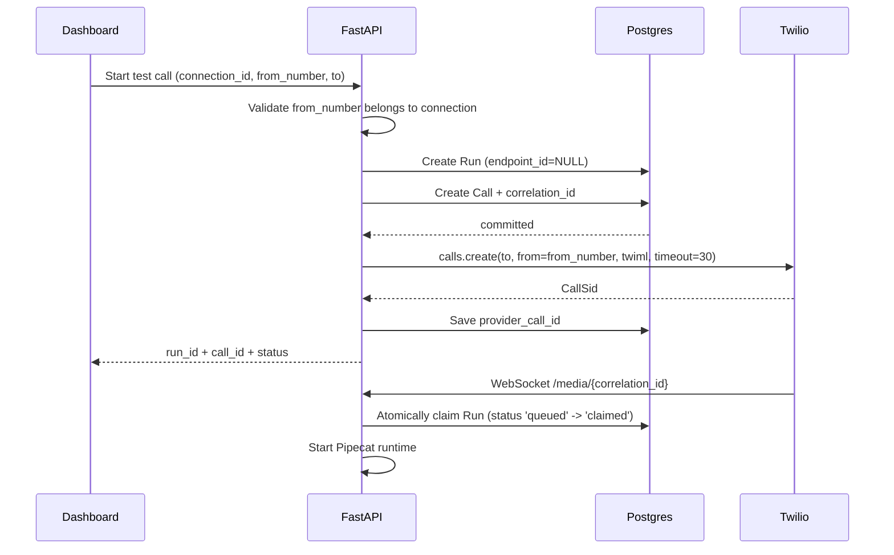
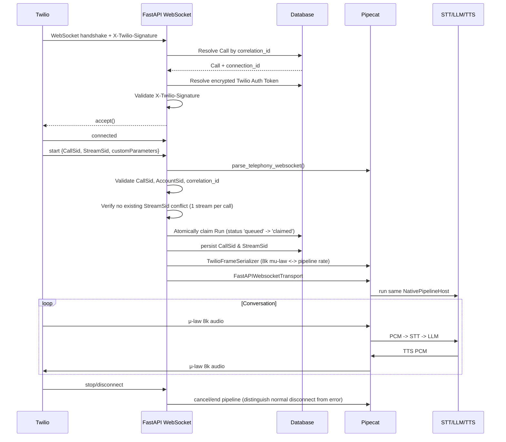
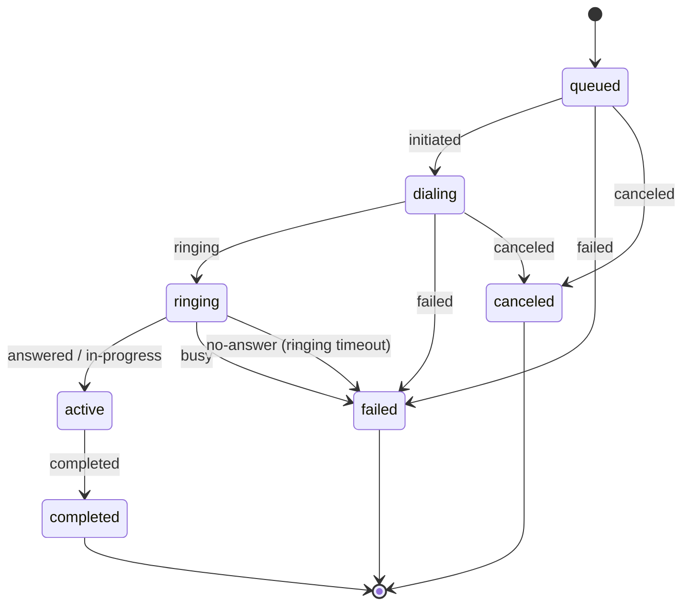
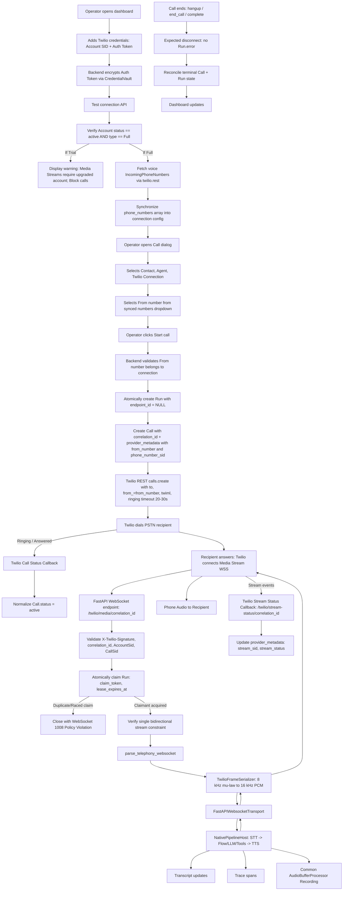

You are implementing Twilio telephony support in an existing Python/FastAPI/Pipecat voice-agent project.

This is an implementation task, not a research task.

Do not spend time re-researching Pipecat or Twilio architecture unless the installed package version proves incompatible with an API explicitly documented below. The integration design, expected architecture, key Pipecat APIs, Twilio behavior, schema direction, test plan, and decision rules are already specified here.

Your job is to inspect the existing repository, map the instructions below onto its actual structure, implement the changes carefully, test every milestone, preserve the existing SIM7600 path, and leave the repository in a clean, understandable state.

The final system must support both:

```text
SIM7600 modem
    ↓ USB PCM / AT commands
existing Pipecat agent runtime

and

Twilio Programmable Voice
    ↓ Media Streams WebSocket
same Pipecat agent runtime
```

The STT, VAD, LLM, Pipecat Flows, tools, transcript tracking, classification, callback tools, tracing, and TTS layers must remain shared.

Do not create a separate "Twilio agent runtime."

Do not duplicate the entire pipeline.

Do not remove SIM7600 support.

Do not silently redesign unrelated parts of the project.


# 1. Understand the existing architecture before editing

The relevant architecture already known from this project is approximately:

```text
AgentVersion
     │
     ├── flow config
     ├── STT config
     ├── LLM config
     ├── TTS config
     ├── tools
     └── knowledge
          │
          ▼
       Run snapshot
          │
          ▼
NativePipelineHost
          │
          ├── Sarvam STT
          ├── VAD
          ├── LLM
          ├── Pipecat FlowManager
          ├── tools
          ├── TTS
          ├── EvidenceObserver
          ├── ExchangeTracker
          └── currently constructs Sim7600UsbAudioBridge
```

The current pipeline is essentially:

```python
pipeline = Pipeline(
    [
        transport.input(),
        stt,
        aggregators.user(),
        llm,
        tts,
        transport.output(),
        aggregators.assistant(),
    ]
)
```

This structure is good.

Preserve it.

The main problem is that `NativePipelineHost.prepare()` currently decides what `transport` is by constructing the SIM7600 bridge itself.

The current runtime also has a modem-specific conversation lifetime roughly equivalent to:

```python
async def converse(self, modem):
    ...
    while self.runner_task and not self.runner_task.done():
        ...
        if await modem.state() != CallState.ACTIVE:
            self._call_hung_up = True
            await self.worker.cancel()
            break
```

Those are the two main SIM-specific couplings to remove.

Before editing, locate the actual implementations/usages of:

```text
NativePipelineHost
Sim7600Modem
Sim7600UsbAudioBridge
TelephonyTransport
Call
Run
RuntimeEndpoint
IntegrationConnection
IntegrationSecret
CredentialVault
CallCapture
RunArtifact
current call-start API/service
current run creation service
runtime endpoint claiming
FastAPI router registration
frontend integrations page
frontend call/run creation page
Alembic migrations
backend tests
frontend tests
```

Use repository search only.

Examples:

```bash
rg "NativePipelineHost"
rg "Sim7600UsbAudioBridge"
rg "Sim7600Modem"
rg "CallCapture"
rg "IntegrationConnection"
rg "IntegrationSecret"
rg "CredentialVault"
rg "provider_call_id"
rg "correlation_id"
rg "RuntimeEndpoint"
rg "endpoint_id"
rg "modem_start"
rg "recording_path"
rg "APIRouter"
```

Do not move files simply because names differ from this prompt.

Adapt this architecture to the existing project layout.

---

# 2. Files I have not seen and how you should decide what to do

I have seen the important models and the core Pipecat runtime, but I have not seen every repository file.

In particular, I have not seen enough of:

```text
the call-start API
the run claiming/orchestration service
FastAPI app/router composition
the full CredentialVault implementation
Alembic migration layout
the frontend Integration UI
the frontend Run/Call creation UI
the frontend API client
the full CallCapture implementation
test fixtures and test organization
deployment/public URL configuration
```

Do not treat this as permission to invent a parallel architecture.

Use these decision rules.

## Existing API/service exists

If there is already a service responsible for:

```text
creating Runs
creating Calls
claiming RuntimeEndpoints
dialing the SIM modem
starting NativePipelineHost
updating final call states
```

extend that service with a provider branch.

Do not create an unrelated second orchestration stack.

Prefer:

```python
if provider == "sim7600":
    ...
elif provider == "twilio":
    ...
```

at the telephony orchestration boundary while keeping the pipeline host provider-neutral.

Do not scatter `if provider == "twilio"` throughout STT/LLM/Flow/TTS code.

## Existing integration CRUD exists

If `IntegrationConnection` already has generic routes/services used by WhatsApp or other integrations, extend those.

Do not create a completely separate credential table just for Twilio.

Use:

```text
IntegrationConnection.provider = "twilio_voice"
```

unless the repository has an established provider naming convention that clearly calls for another name.

Store public/non-secret configuration in `IntegrationConnection.config`.

Store secrets in `IntegrationSecret`.

## Existing vault exists

Use `CredentialVault`.

Do not introduce another encryption system.

## Existing migration conventions exist

Follow them.

Do not hand-edit the database.

Create an Alembic migration or whatever migration mechanism the repo already uses.

## Existing frontend pattern exists

Reuse the existing shadcn/Tailwind/forms/API conventions.

Do not add a new UI framework.

## Existing recording system is more sophisticated than shown

Adapt the Pipecat recording change to it.

The goal is transport-independent recording, not replacing a working artifact subsystem.

## Existing call orchestration already has a provider abstraction

The conceptual architecture in this prompt is authoritative; exact class names may be adapted to the existing repository.

---

# 3. Non-negotiable architecture

Target architecture:

```text
                         ┌────────────────────────────┐
                         │        Dashboard           │
                         └─────────────┬──────────────┘
                                       │
                                create test call
                               (select from_number)
                                       │
                                       ▼
                            Call orchestration
                                       │
                   ┌───────────────────┴────────────────────┐
                   │                                        │
                   ▼                                        ▼
             SIM7600 provider                        Twilio provider
                   │                                        │
          AT dial / USB PCM                        REST create Call
                   │                               (from_number chosen)
                   │                                        │
                   │                               PSTN + Media Stream
                   │                                        │
                   └───────────────────┬────────────────────┘
                                       │
                                BaseTransport
                                       │
                                       ▼
                            NativePipelineHost
                                       │
                       ┌───────────────┼───────────────┐
                       ▼               ▼               ▼
                      STT            LLM/Flow          TTS
                                       │
                                       ▼
                             tools / tracking / traces
```

### Account vs Phone Number Relationship

One `IntegrationConnection` represents exactly one Twilio account. The originating phone number (`from_number`) is chosen per call, not bound to the connection credentials:

```text
IntegrationConnection # one Twilio account
│
├── Account SID
├── Auth Token [encrypted once in IntegrationSecret]
│
└── Phone Numbers [synchronized in config]
      ├── +1 415 xxx xxxx
      │    ├── PN SID
      │    ├── friendly name
      │    └── voice = true
      │
      ├── +44 20 xxx xxxx
      │    ├── PN SID
      │    └── voice = true
      │
      └── +91 ...
            │
            ▼ (selected per Call)
Twilio account [ Primary Twilio ▼ ] From number [ +1 415 xxx xxxx ▼ ] To [ +91xxxxxxxxxx ] [Start call]
```

### Core Non-Negotiable Rules

1. **Twilio Full Account Required**: Twilio Trial accounts explicitly block the `<Stream>` verb. Therefore, `<Connect><Stream>` Media Streams cannot be used on a trial account. Test connection must verify `status == "active"` and `type == "Full"`. If Trial, the UI must display: *"Connected, but Media Streams require an upgraded Twilio account"* and block call creation.
2. **Multiple Phone Numbers per Account**: A Twilio connection synchronizes voice-capable `IncomingPhoneNumbers`. The caller chooses an active originating number from the connection's synchronized numbers at call-time.
3. **Atomic Run Claiming on WebSocket Connection**: Because Twilio runs use `endpoint_id = NULL`, the SIM endpoint partial unique index does not prevent duplicate workers. The WebSocket handler must atomically claim the Run using `claim_token`, `claimed_at`, and `lease_expires_at` before starting `NativePipelineHost`.
4. **Dual Call and Stream Status Callbacks**: Twilio supports separate callbacks for the Call resource and the Media Stream (`<Stream statusCallback="...">`). Both endpoints (`/twilio/call-status/{correlation_id}` and `/twilio/stream-status/{correlation_id}`) are provided, keeping PSTN call state distinct from Media Stream state.
5. **One Bidirectional Stream per Call**: Twilio permits only one bidirectional Stream per Call. If another WebSocket attempts to bind after a `StreamSid` is attached, it must be rejected (code 1008).
6. **V1 Scope Constraints**:
   - Outbound test calls only; never modify incoming voice webhooks on Twilio phone numbers.
   - Restrict originating numbers to Twilio-owned voice-capable `IncomingPhoneNumbers`; do not support arbitrary Verified Outgoing Caller IDs in v1.
   - Credentials are strictly Account SID + Auth Token (no API keys in v1 because Pipecat's `TwilioFrameSerializer(auto_hang_up=True)` requires Account SID + Auth Token for REST termination).
   - Subaccounts are treated as distinct `IntegrationConnection` records, never merged recursively.
7. **Timeouts and Expected Disconnects**:
   - Configurable ringing timeout (20–30s) to cleanly finalize unanswered calls.
   - Media-connect timeout to fail/reconcile runs where Twilio never opens the WebSocket after dial.
   - Distinguish expected terminations (caller hangup, agent `end_call`, Twilio complete, server close) from pipeline errors—never mark legitimate disconnects as `Run.error = "WebSocket disconnected"`.

The pipeline must not care whether audio originated from:

```text
SIM7600
Twilio
future WebRTC
future Telnyx
future Plivo
```

That is the reason for this refactor.

---

# 4. Verified Pipecat APIs to use

Treat these as the expected Pipecat integration APIs.

Imports:

```python
from pipecat.runner.utils import parse_telephony_websocket
from pipecat.serializers.twilio import TwilioFrameSerializer
from pipecat.transports.websocket.fastapi import (
    FastAPIWebsocketParams,
    FastAPIWebsocketTransport,
)
```

`parse_telephony_websocket(websocket)` consumes the initial telephony handshake and identifies Twilio.

Expected Twilio result:

```python
transport_type, call_data = await parse_telephony_websocket(websocket)

assert transport_type == "twilio"

stream_sid = call_data["stream_id"]
call_sid = call_data["call_id"]
custom_parameters = call_data.get("body", {})
```

Current Pipecat `CallData` also supports attribute-style access, but using dictionary-style access for the required wire IDs is fine.

`TwilioFrameSerializer` constructor:

```python
TwilioFrameSerializer(
    stream_sid=...,
    call_sid=...,
    account_sid=...,
    auth_token=...,
    params=TwilioFrameSerializer.InputParams(
        twilio_sample_rate=8000,
        sample_rate=<pipeline rate>,
        auto_hang_up=True,
    ),
)
```

Important behavior:

```text
Twilio wire audio:
audio/x-mulaw
8000 Hz
mono

Pipecat internal pipeline:
can remain at the configured snapshot sample rate,
including 16000 Hz.

TwilioFrameSerializer:
decodes μ-law
resamples incoming audio
resamples outgoing PCM
encodes μ-law
base64 packages media frames
handles DTMF
sends Twilio "clear" on Pipecat interruption
can automatically terminate the Twilio Call when EndFrame/CancelFrame occurs
```

Do NOT implement custom μ-law codec logic.

Do NOT manually base64 encode/decode media in application code.

Do NOT manually perform Twilio 20 ms serial-style pacing.

That is serializer/transport responsibility.

Pipecat's WebSocket transport:

```python
params = FastAPIWebsocketParams(
    audio_in_enabled=True,
    audio_out_enabled=True,
    add_wav_header=False,
    serializer=serializer,
)

transport = FastAPIWebsocketTransport(
    websocket=websocket,
    params=params,
)
```

`add_wav_header` must be `False` for telephony streaming.

Pipecat's current own telephony helper follows essentially this same pattern.

---

# 5. Verified Twilio behavior to design around

Use Twilio Programmable Voice with bidirectional Media Streams.

For an AI conversation, use:

```xml
<Response>
    <Connect>
        <Stream url="wss://..." statusCallback="https://.../stream-status/CORRELATION_ID" statusCallbackMethod="POST">
            <Parameter name="correlation_id" value="CORRELATION_ID"/>
            <Parameter name="run_id" value="RUN_ID"/>
        </Stream>
    </Connect>
</Response>
```

Do not use `<Start><Stream>` for this use case.

`<Start><Stream>` is unidirectional.

`<Connect><Stream>` is bidirectional and lets the AI send audio back into the phone call.

Twilio's stream URL must use:

```text
wss://
```

The `<Stream url>` does not support query parameters.

Therefore this is invalid design:

```text
wss://api.example.com/twilio/media?run_id=123
```

Use a path correlation token and `<Parameter>`:

```text
wss://api.example.com/api/v1/telephony/twilio/media/<correlation_id>
```

plus:

```xml
<Parameter name="correlation_id" value="..."/>
```

Twilio exposes custom parameters in:

```text
start.customParameters
```

The initial WebSocket messages include:

```text
connected
start
media...
```

The start event includes:

```text
streamSid
callSid
accountSid
customParameters
mediaFormat:
    encoding = audio/x-mulaw
    sampleRate = 8000
    channels = 1
```

Twilio bidirectional Media Streams support inbound caller audio and your server sends media back to Twilio. A bidirectional Stream is terminated by ending the Call or closing the WebSocket.

### Critical Twilio Constraints & Behavioral Nuances

1. **Trial Accounts Block `<Stream>`**: Twilio trial rules explicitly disallow the `<Stream>` verb. Any trial account attempting `<Connect><Stream>` will fail. Upgraded "Full" accounts are strictly required.
2. **One Bidirectional Stream Per Call**: Twilio enforces a limit of one bidirectional Media Stream per Call. If a reconnect or duplicate WebSocket arrives with a different or subsequent stream, it must be rejected immediately.
3. **Separate Stream Status Callbacks**: In addition to Call status callbacks, `<Stream>` supports its own `statusCallback`, posting events:
   - `stream-started`
   - `stream-stopped`
   - `stream-error` (with `StreamSid` and `StreamError`)
   This allows distinguishing between PSTN status and media transport health.
4. **Originating Identity**: Twilio's `calls.create` takes `from_` independently from credentials. In v1, `from_` must be a voice-capable number owned by that Twilio account (`IncomingPhoneNumber`).
5. **No Inbound Webhook Mutation**: Do not update or alter the incoming voice webhook URL of the Twilio phone numbers. The integration is strictly for outbound test calls.
6. **No API Key / Secret**: Pipecat's `TwilioFrameSerializer(auto_hang_up=True)` REST hangup implementation relies specifically on `account_sid` and `auth_token`. Auth Token is mandatory.

---

# 6. Dependencies

Inspect `pyproject.toml`, `uv.lock`, and the currently installed Pipecat dependency first.

Do not arbitrarily upgrade Pipecat to a new major/minor version merely to implement Twilio.

The required capabilities are:

```text
pipecat-ai websocket extra
Twilio Python SDK
```

Expected commands if compatible with the repository's dependency strategy:

```bash
uv add "pipecat-ai[websocket]"
uv add twilio
```

If `pipecat-ai` is already declared with other extras, merge `websocket` into the existing dependency declaration rather than creating duplicate Pipecat dependency entries.

For example, if it is currently conceptually:

```toml
pipecat-ai = { extras = ["silero", "..."], version = "..." }
```

add the websocket extra to the same dependency.

The Twilio SDK is needed for:

```python
from twilio.rest import Client
from twilio.twiml.voice_response import VoiceResponse
from twilio.request_validator import RequestValidator
```

After dependency changes run:

```bash
uv sync
```

and an import smoke test:

```bash
uv run python -c "from pipecat.serializers.twilio import TwilioFrameSerializer; from pipecat.transports.websocket.fastapi import FastAPIWebsocketTransport; from twilio.rest import Client; print('ok')"
```

---

# 7. Milestone 1 — Make NativePipelineHost transport-independent

This is the most important refactor.

Do this before implementing Twilio.

Current conceptual problem:

```python
NativePipelineHost.prepare(...)
    ...
    endpoint = snapshot["_resolved"]["endpoint"]

    transport = Sim7600UsbAudioBridge(
        endpoint["audio_port"],
        endpoint["baudrate"],
        ...
    ).transport()
```

This causes the AI runtime to own telephony selection.

Change it so the host receives a Pipecat transport.

Preferred direction:

```python
from pipecat.transports.base_transport import BaseTransport


class NativePipelineHost:
    async def prepare(
        self,
        snapshot: dict,
        tracker: ExchangeTracker,
        *,
        transport: BaseTransport,
    ) -> None:
        self.tracker = tracker
        self._snapshot = snapshot

        rate = snapshot["audio"]["sample_rate"]

        # create STT / LLM / TTS / VAD / context as before

        pipeline = Pipeline(
            [
                transport.input(),
                stt,
                aggregators.user(),
                llm,
                tts,
                transport.output(),
                aggregators.assistant(),
            ]
        )

        self.worker = PipelineWorker(
            pipeline,
            observers=[self.observer],
            enable_rtvi=False,
            params=PipelineParams(
                enable_metrics=True,
                audio_in_sample_rate=rate,
                audio_out_sample_rate=rate,
            ),
        )

        self.flow = TracedFlowManager(
            worker=self.worker,
            llm=llm,
            context_aggregator=aggregators,
            transport=transport,
            tracker=tracker,
            bindings=snapshot["_resolved"]["tools"],
            observer=self.observer,
        )
```

Move this logic:

```python
Sim7600UsbAudioBridge(...)
```

out to the SIM provider/orchestration layer.

Existing SIM startup should become approximately:

```python
bridge = Sim7600UsbAudioBridge(
    endpoint["audio_port"],
    endpoint["baudrate"],
    sample_rate=snapshot["audio"]["sample_rate"],
    channels=1,
    capture=...,
    frame_ms=snapshot["audio"]["frame_ms"],
)

await host.prepare(
    snapshot,
    tracker,
    transport=bridge.transport(),
)
```

The exact location depends on the existing call runner/service.

Do not change:

```text
STT setup
LLM setup
TTS setup
VAD configuration
FlowManager nodes
Flow tools
EvidenceObserver
ExchangeTracker
context handling
classification
WhatsApp tools
callback tools
```

unless needed because of transport decoupling.

### Milestone 1 tests

Add tests proving:

```text
1. NativePipelineHost no longer creates Sim7600UsbAudioBridge.
2. A supplied fake BaseTransport is used.
3. Pipeline order remains unchanged.
4. Pipeline sample rates still come from snapshot["audio"]["sample_rate"].
5. SIM7600 orchestration still creates Sim7600UsbAudioBridge correctly.
6. Existing SIM tests still pass.
```

Run existing runtime tests.

Commit this milestone before adding Twilio if tests are green.

---

# 8. Milestone 2 — Remove modem-specific lifecycle logic from NativePipelineHost

`NativePipelineHost.converse(modem)` currently polls:

```python
await modem.state()
```

That cannot work for Twilio.

Create a provider-neutral call lifetime abstraction.

A simple shape is:

```python
from typing import Protocol


class CallLifecycle(Protocol):
    async def wait_ended(self) -> None: ...
```

SIM implementation:

```python
class Sim7600CallLifecycle:
    def __init__(self, modem, poll_interval: float = 1.0):
        self.modem = modem
        self.poll_interval = poll_interval

    async def wait_ended(self) -> None:
        while True:
            await asyncio.sleep(self.poll_interval)
            state = await self.modem.state()
            if state != CallState.ACTIVE:
                return
```

Twilio implementation can be event-driven:

```python
class TwilioCallLifecycle:
    def __init__(self) -> None:
        self._ended = asyncio.Event()

    def mark_ended(self) -> None:
        self._ended.set()

    async def wait_ended(self) -> None:
        await self._ended.wait()
```

Do not create this exact class if an equivalent existing abstraction already exists.

Then make `converse()` independent of modem APIs.

Example direction:

```python
async def converse(self, lifecycle: CallLifecycle | None = None) -> dict:
    self.tracker.begin("greeting")

    await self.flow.initialize(self._node(self._snapshot["flow"]["initial_node"]))

    lifecycle_task = asyncio.create_task(lifecycle.wait_ended()) if lifecycle is not None else None

    try:
        while self.runner_task and not self.runner_task.done():
            if self.errors and not self._call_hung_up:
                raise RuntimeError(self.errors[-1])

            if lifecycle_task and lifecycle_task.done():
                self._call_hung_up = True
                await self.worker.cancel()
                break

            await asyncio.sleep(0.1)

        if self.runner_task:
            await self.runner_task

        if self.errors and not self._call_hung_up:
            raise RuntimeError(self.errors[-1])

        return {"flow_node": self.flow.current_node}
    finally:
        if lifecycle_task and not lifecycle_task.done():
            lifecycle_task.cancel()
```

Better still, if the existing worker/transport lifecycle already exposes a clean disconnect event, use that rather than a polling loop.

For Twilio, both:

```text
WebSocket disconnected
terminal Twilio status callback
```

should be able to mark the lifecycle ended.

### Preserve SIM behavior

Do not change the meaning of existing SIM states.

Keep:

```text
IDLE
DIALING
RINGING
ACTIVE
DISCONNECTED
```

where they are still useful to SIM7600.

The generic AI host simply should not import them anymore.

### Milestone 2 tests

Test:

```text
SIM lifecycle waits while ACTIVE.
SIM lifecycle exits when state changes.
Twilio lifecycle blocks until mark_ended().
NativePipelineHost cancels worker when lifecycle completes.
Pipeline error still raises normally.
Lifecycle task is cleaned up.
```

---

# 9. Milestone 3 — Database support

The current `Call` model already has:

```text
provider
provider_call_id
correlation_id
provider_metadata
run_id
contact_id
agent_version_id
target_snapshot
status
answered_at
ended_at
recording_path
```

Use these fields.

Map Twilio values as:

```text
Call.provider = "twilio"
Call.provider_call_id = CallSid
Call.correlation_id = local UUID used before Twilio exists
Call.provider_metadata["stream_sid"] = StreamSid
Call.provider_metadata["from_number"] = "+14155551212"
Call.provider_metadata["phone_number_sid"] = "PN..."
Call.provider_metadata["twilio_status"] = "in-progress"
Call.provider_metadata["stream_status"] = "started"
```

The Call should record which number actually originated that specific call in `provider_metadata` (or via an explicit `from_number` column on `calls` if dashboard queries it frequently).

Never put the Auth Token in:

```text
Call.provider_metadata
Run.resolved_config
contact_snapshot
trace payloads
logs
API responses
frontend state persisted to localStorage
```

Add a nullable connection reference to the Call:

```python
telephony_connection_id: Mapped[str | None] = mapped_column(
    ForeignKey("integration_connections.id"),
    index=True,
)
```

Use the repository's naming conventions if it already has another field representing the same relation.

Create a migration. Backfill is not needed because the column is nullable.

### Important RuntimeEndpoint & Atomic Run Claiming Behavior

The current `Run` model has a partial unique index preventing more than one active run per `endpoint_id`:

```python
Index(
    "uq_endpoint_active_run",
    "endpoint_id",
    unique=True,
    postgresql_where=text("status IN ('claimed','running','uncertain')"),
)
```

SIM7600 needs this because a physical modem is a scarce single-call endpoint.

Twilio is not tied to that physical endpoint. For Twilio runs:

```python
run.endpoint_id = None
```

Do not create a fake RuntimeEndpoint for Twilio merely to satisfy SIM assumptions. Do not remove the existing endpoint uniqueness rule because SIM still relies on it.

#### Critical: Atomic Run Claim / Lease Mechanism for Twilio Runs

Because `run.endpoint_id = None`, the partial unique index on `endpoint_id` does NOT protect Twilio runs against concurrent worker execution!

`Run` already contains lease fields:
```python
claim_token: Mapped[str | None] = mapped_column(String(36))
claimed_at: Mapped[datetime | None] = mapped_column(DateTime(timezone=True))
lease_expires_at: Mapped[datetime | None] = mapped_column(DateTime(timezone=True))
```

The WebSocket handler MUST atomically claim the run before starting `NativePipelineHost`:

```text
WSS connects
   ↓
lookup correlation_id
   ↓
atomically claim Run (status 'queued' -> 'claimed', assign claim_token, lease)
   ↓
only winning claimant may start pipeline
```

If duplicate connections, retries, or reconnects arrive, any attempt to claim an already-claimed or running run must be rejected (closing WebSocket with code 1008).

### `modem_start` / `modem_end`

Those are SIM-specific legacy/provider fields. Do not rename or delete them. For Twilio calls leave them empty. Use `provider_metadata` for Twilio-specific non-secret data.

### Milestone 3 tests

Verify:

```text
existing SIM Call can still be created without telephony_connection_id
Twilio Call can reference IntegrationConnection
provider defaults do not break old data
multiple active Twilio Runs with endpoint_id NULL do not violate the SIM endpoint partial unique index
Call.provider_metadata records stream_sid, from_number, and phone_number_sid
atomic Run claiming prevents duplicate worker execution
correlation_id remains unique
```

---

# 10. Milestone 4 — Twilio integration credentials & phone number synchronization

Use the existing generic integration models.

### Integration Connection Model

One `IntegrationConnection` represents one Twilio account:

```text
IntegrationConnection
provider = "twilio_voice"
label = user supplied (e.g. "Primary Twilio")
enabled = true

config = {
    "account_sid": "ACxxxxxxxx...",
    "phone_numbers": [
        {
            "sid": "PN111",
            "phone_number": "+14155551212",
            "friendly_name": "US Sales",
            "voice": true
        },
        {
            "sid": "PN222",
            "phone_number": "+442079460000",
            "friendly_name": "UK Sales",
            "voice": true
        }
    ]
}
```

Secret:

```text
IntegrationSecret
connection_id = <connection>
name = "auth_token"
ciphertext = <CredentialVault encrypted token>
key_id = <vault key id>
```

Do not store Auth Token directly in `config`.

### Typed Credentials Runtime Object

The originating phone number is a per-call selection, NOT an account credential. Update `TwilioCredentials` to:

```python
from dataclasses import dataclass


@dataclass(frozen=True)
class TwilioCredentials:
    account_sid: str
    auth_token: str
```

### Credential Resolution Service

```python
async def resolve_twilio_credentials(
    connection_id: str,
) -> TwilioCredentials:
    connection = ...
    secret = ...

    if connection.provider != "twilio_voice":
        raise ValueError("Connection is not a Twilio Voice connection")

    if not connection.enabled:
        raise ValueError("Twilio connection is disabled")

    auth_token = CredentialVault.from_env().decrypt(
        secret.ciphertext,
        secret.key_id,
    )

    return TwilioCredentials(
        account_sid=connection.config["account_sid"],
        auth_token=auth_token,
    )
```

Validate:
- `account_sid` not blank and begins with `AC`
- `auth_token` exists

### Credential Test Endpoint & Account Type Check

Twilio Trial accounts explicitly block `<Connect><Stream>` Media Streams. Therefore, the "Test connection" operation must fetch the Twilio Account resource and check both:
1. `account.status == "active"`
2. `account.type == "Full"`

```python
account = await asyncio.to_thread(client.api.v2010.accounts(credentials.account_sid).fetch)

if account.status != "active":
    raise ValidationError(f"Twilio account is {account.status}")

if account.type != "Full":
    # Surface explicit warning / restriction
    return {
        "status": "warning",
        "provider": "twilio_voice",
        "account_sid": f"AC...{credentials.account_sid[-4:]}",
        "account_type": account.type,
        "message": "Connected, but Media Streams require an upgraded Twilio account. Trial accounts block <Stream>.",
        "phone_numbers": [],
    }
```

Do NOT allow starting a call if the account is a Trial account.

### Phone Number Fetching & Synchronization

When testing, saving, or refreshing the connection, fetch voice-capable incoming phone numbers:

```python
numbers = await asyncio.to_thread(client.incoming_phone_numbers.list)

available_numbers = [
    {
        "sid": number.sid,
        "phone_number": number.phone_number,
        "friendly_name": number.friendly_name,
        "voice": bool(number.capabilities.get("voice")),
    }
    for number in numbers
    if number.capabilities.get("voice")
]

# Update synchronized list in connection config
connection.config["phone_numbers"] = available_numbers
```

### "Refresh Phone Numbers" Action

Provide an API endpoint:
`POST /api/v1/integrations/{connection_id}/refresh-numbers`
that contacts Twilio via `client.incoming_phone_numbers.list`, updates `connection.config["phone_numbers"]`, and returns the refreshed list.

### Subaccount Isolation Rule

Treat subaccounts as completely separate `IntegrationConnection` records.
Do not recursively merge a parent account and its subaccounts into one selector.
Keep:
`IntegrationConnection = exact Account SID = exact Auth Token = numbers belonging to that account`.

### V1 Scope Rules

1. **Outbound Twilio test calls only**: Never modify or overwrite the incoming voice webhook URL of any Twilio number.
2. **Twilio-owned `IncomingPhoneNumbers` only**: In v1, restrict `from_number` choices to verified voice-capable Twilio-owned numbers. Do not support arbitrary Verified Outgoing Caller IDs in v1.
3. **No API Key / Secret**: Require Account SID and Auth Token explicitly. Pipecat's `TwilioFrameSerializer(auto_hang_up=True)` REST hang-up expects `account_sid` and `auth_token`.

Example sanitized test response:

```json
{
  "status": "ok",
  "provider": "twilio_voice",
  "account_sid": "AC...last4",
  "account_type": "Full",
  "phone_numbers": [
    {
      "sid": "PN111",
      "phone_number": "+14155551212",
      "friendly_name": "US Sales",
      "voice": true
    },
    {
      "sid": "PN222",
      "phone_number": "+442079460000",
      "friendly_name": "UK Sales",
      "voice": true
    }
  ]
}
```

Never return the Auth Token.

---

# 11. Milestone 5 — Public callback URL configuration

Twilio must reach your backend from the public internet.

Add or reuse one configuration value representing the externally visible application URL:

```text
VOICE_PUBLIC_BASE_URL=https://voice.example.com
```

From that derive:

```text
HTTPS Call Status:
https://voice.example.com/api/v1/telephony/twilio/call-status/<correlation_id>

HTTPS Stream Status:
https://voice.example.com/api/v1/telephony/twilio/stream-status/<correlation_id>

WSS Media Stream:
wss://voice.example.com/api/v1/telephony/twilio/media/<correlation_id>
```

Helper implementation:

```python
class PublicTelephonyUrls:
    def __init__(self, public_base_url: str):
        self.base = public_base_url.rstrip("/")

    def twilio_call_status(self, correlation_id: str) -> str:
        return f"{self.base}/api/v1/telephony/twilio/call-status/{correlation_id}"

    def twilio_stream_status(self, correlation_id: str) -> str:
        return f"{self.base}/api/v1/telephony/twilio/stream-status/{correlation_id}"

    def twilio_media(self, correlation_id: str) -> str:
        if self.base.startswith("https://"):
            ws_base = "wss://" + self.base[len("https://") :]
        elif self.base.startswith("http://"):
            ws_base = "ws://" + self.base[len("http://") :]
        else:
            raise ValueError("PUBLIC_BASE_URL must use http:// or https://")
        return f"{ws_base}/api/v1/telephony/twilio/media/{correlation_id}"
```

Production Twilio Media Streams must use secure `wss://`.

---

# 12. Milestone 6 — Twilio outbound Call controller

Create a Twilio telephony adapter/service under `packages/voice_runtime/voice_runtime/telephony/twilio.py`.

```python
from __future__ import annotations

import asyncio
from dataclasses import dataclass

from twilio.rest import Client
from twilio.twiml.voice_response import VoiceResponse


@dataclass(frozen=True)
class TwilioCredentials:
    account_sid: str
    auth_token: str


def build_twilio_stream_twiml(
    *,
    media_ws_url: str,
    stream_status_callback_url: str,
    correlation_id: str,
    run_id: str,
) -> str:
    response = VoiceResponse()
    connect = response.connect()
    stream = connect.stream(
        url=media_ws_url,
        status_callback=stream_status_callback_url,
        status_callback_method="POST",
    )
    stream.parameter(name="correlation_id", value=correlation_id)
    stream.parameter(name="run_id", value=run_id)
    return str(response)


class TwilioCallController:
    def __init__(self, credentials: TwilioCredentials) -> None:
        self.credentials = credentials
        self.client = Client(
            credentials.account_sid,
            credentials.auth_token,
        )

    async def dial(
        self,
        *,
        to: str,
        from_number: str,
        media_ws_url: str,
        status_callback_url: str,
        stream_status_callback_url: str,
        correlation_id: str,
        run_id: str,
        ringing_timeout: int = 30,
    ) -> str:
        twiml = build_twilio_stream_twiml(
            media_ws_url=media_ws_url,
            stream_status_callback_url=stream_status_callback_url,
            correlation_id=correlation_id,
            run_id=run_id,
        )

        call = await asyncio.to_thread(
            self.client.calls.create,
            to=to,
            from_=from_number,
            twiml=twiml,
            timeout=ringing_timeout,
            status_callback=status_callback_url,
            status_callback_method="POST",
            status_callback_event=[
                "initiated",
                "ringing",
                "answered",
                "completed",
            ],
        )

        return str(call.sid)

    async def hangup(self, call_sid: str) -> None:
        await asyncio.to_thread(
            self.client.calls(call_sid).update,
            status="completed",
        )
```

The generated TwiML:

```xml
<Response>
  <Connect>
    <Stream url="wss://voice.example.com/api/v1/telephony/twilio/media/CORRELATION_ID"
            statusCallback="https://voice.example.com/api/v1/telephony/twilio/stream-status/CORRELATION_ID"
            statusCallbackMethod="POST">
      <Parameter name="correlation_id" value="CORRELATION_ID" />
      <Parameter name="run_id" value="RUN_ID" />
    </Stream>
  </Connect>
</Response>
```

Rules:
- Configurable ringing timeout (`timeout=ringing_timeout`, e.g. 20–30s) prevents unanswered calls from hanging in progress indefinitely.
- Stream status callbacks are attached directly to `<Stream>` for stream-level health events (`stream-started`, `stream-stopped`, `stream-error`).
- Never put credentials or PII in custom parameters. Use opaque IDs only (`correlation_id`, `run_id`).

---

# 13. Important race condition & timeouts: create DB records before dialing

Twilio can establish the Media Stream WebSocket before the REST `calls.create` returns.

Therefore do not:

```text
create Twilio call
THEN create DB Call/Run
```

Use this sequence:

```text
1. validate request & verify from_number belongs to connection
2. resolve AgentVersion & Contact
3. resolve Twilio integration credentials & verify account is Full (not Trial)
4. create Run (channel="phone", endpoint_id=None, status="queued")
5. create Call (provider="twilio", correlation_id=local_uuid, status="queued")
6. commit DB transaction
7. call Twilio REST calls.create(...)
8. get CallSid
9. update Call.provider_call_id = CallSid
```

Flow:



If Twilio call creation fails after DB commit:
- `Call.status = "failed"`
- `Run.status = "failed"`
- `Call.ended_at = now()`, `Run.ended_at = now()`
- `Call.provider_metadata` records sanitized Twilio error code and message.

### Media-Connect Timeout

After `calls.create()` succeeds, don't leave a Run in dialing/running indefinitely if Twilio never opens the WebSocket (e.g. answered, but media connection fails or drops):

```text
Call created
   ↓
ringing / answered
   ↓
expect Media Stream connection (bounded timeout, e.g. 20s post-answer)
   ↓
if no media stream connects:
   reconcile with Twilio Call resource (fetch call status)
   terminate/fail runtime cleanly
```

---

# 14. Milestone 7 — Call-start API provider selection

Extend the call-start API to accept telephony provider choice and originating number.

Desired request semantics:

```json
{
  "agent_version_id": "...",
  "contact_id": "...",
  "telephony": {
    "provider": "twilio",
    "connection_id": "conn_123",
    "from_number": "+14155551212"
  }
}
```

SIM remains:

```json
{
  "agent_version_id": "...",
  "contact_id": "...",
  "telephony": {
    "provider": "sim7600",
    "endpoint_id": "ep_123"
  }
}
```

### Server-Side `from_number` Validation

**Never trust the frontend's `from_number` blindly.**

When starting a call:

```python
numbers = await twilio_service.list_voice_numbers(connection_id)
selected = next(
    (number for number in numbers if number["phone_number"] == requested_from_number),
    None,
)

if selected is None:
    raise ValidationError(
        "Selected From number does not belong to this Twilio connection or lacks voice capability"
    )
```

Also re-verify or refresh against Twilio if the cached list is stale, ensuring deleted or transferred numbers fail before dialing.

Internal branch:

```python
match provider:
    case "sim7600":
        await start_sim_call(...)
    case "twilio":
        await start_twilio_call(...)
    case _:
        raise UnsupportedTelephonyProvider(...)
```

For Twilio:
- `endpoint_id = None`
- `telephony_connection_id = selected Twilio connection`
- `provider = "twilio"`
- `Call.provider_metadata["from_number"] = requested_from_number`
- `Call.provider_metadata["phone_number_sid"] = selected["sid"]`

For SIM:
- `endpoint_id = selected modem endpoint`
- `provider = "sim7600"`
- `telephony_connection_id = None`

The frontend submits only `connection_id` and `from_number`. It never submits Auth Token.

---

# 15. Milestone 8 — Twilio WebSocket Media endpoint

Create a dedicated FastAPI WebSocket route.

Conceptual route:

```text
/api/v1/telephony/twilio/media/{correlation_id}
```

Flow:



---

# 16. Validate Twilio signatures & callback metadata before accepting external events

Twilio signs requests using:

```text
X-Twilio-Signature
```

Use the official SDK:

```python
from twilio.request_validator import RequestValidator
```

Do not implement HMAC yourself.

Twilio recommends validating incoming webhook and Media Stream requests. Create helpers that work with the externally visible URL.

### Comprehensive Validation Rules

For both WebSocket handshakes and HTTP callbacks, validate more than just `CallSid`:
1. `X-Twilio-Signature` is cryptographically valid against the public URL.
2. `correlation_id` exists in the local database.
3. `call.provider == "twilio"`.
4. `AccountSid == integration.account_sid`.
5. `CallSid == Call.provider_call_id` (if already recorded).
6. custom `run_id == Call.run_id` (if supplied in parameters).
7. custom `correlation_id == URL correlation_id` (if supplied in parameters).

Conceptual HTTP helper:

```python
def validate_twilio_request(
    *,
    auth_token: str,
    url: str,
    params: dict[str, str],
    signature: str,
) -> bool:
    return RequestValidator(auth_token).validate(
        url,
        params,
        signature,
    )
```

For status callbacks:

```python
form = dict(await request.form())
signature = request.headers.get("x-twilio-signature", "")

valid = RequestValidator(auth_token).validate(
    externally_visible_url,
    form,
    signature,
)
```

For WebSocket handshake:

```python
websocket.headers.get("x-twilio-signature")
```

Validate against the exact public URL Twilio was given (`wss://...`).

---

# 17. WebSocket route structure & atomic run claiming

Conceptual implementation:

```python
from fastapi import APIRouter, WebSocket
from pipecat.runner.utils import parse_telephony_websocket
from pipecat.serializers.twilio import TwilioFrameSerializer
from pipecat.transports.websocket.fastapi import (
    FastAPIWebsocketParams,
    FastAPIWebsocketTransport,
)

router = APIRouter()


@router.websocket("/telephony/twilio/media/{correlation_id}")
async def twilio_media(
    websocket: WebSocket,
    correlation_id: str,
):
    call = await call_service.get_by_correlation_id(correlation_id)

    if call is None or call.provider != "twilio":
        await websocket.close(code=1008)
        return

    credentials = await twilio_connections.resolve_credentials(call.telephony_connection_id)

    signature = websocket.headers.get("x-twilio-signature", "")
    public_ws_url = public_urls.twilio_media(correlation_id)

    if not validate_twilio_websocket_signature(
        credentials.auth_token,
        public_ws_url,
        signature,
    ):
        await websocket.close(code=1008)
        return

    await websocket.accept()

    transport_type, call_data = await parse_telephony_websocket(websocket)

    if transport_type != "twilio":
        await websocket.close(code=1008)
        return

    stream_sid = call_data["stream_id"]
    call_sid = call_data["call_id"]
    custom_params = call_data.get("body", {})

    if not stream_sid or not call_sid:
        await websocket.close(code=1008)
        return

    # Comprehensive validation
    if call.provider_call_id and call.provider_call_id != call_sid:
        await websocket.close(code=1008)
        return

    if custom_params.get("run_id") and custom_params["run_id"] != call.run_id:
        await websocket.close(code=1008)
        return

    if custom_params.get("correlation_id") and custom_params["correlation_id"] != correlation_id:
        await websocket.close(code=1008)
        return

    # Hard Constraint: One bidirectional Media Stream per call
    existing_stream = call.provider_metadata.get("stream_sid")
    if existing_stream and existing_stream != stream_sid:
        # Reject duplicate or replacement stream attempts
        await websocket.close(code=1008)
        return

    # Atomic Run Claiming (guards against duplicate workers when endpoint_id is NULL)
    claimed = await run_service.atomically_claim_run(
        run_id=call.run_id,
        expected_status="queued",
    )
    if not claimed:
        # Another worker has already claimed or started this run
        await websocket.close(code=1008)
        return

    await call_service.attach_twilio_media(
        call_id=call.id,
        provider_call_id=call_sid,
        stream_sid=stream_sid,
    )

    snapshot, tracker = await runtime_service.load_run_runtime(call.run_id)

    pipeline_rate = snapshot["audio"]["sample_rate"]

    serializer = TwilioFrameSerializer(
        stream_sid=stream_sid,
        call_sid=call_sid,
        account_sid=credentials.account_sid,
        auth_token=credentials.auth_token,
        params=TwilioFrameSerializer.InputParams(
            twilio_sample_rate=8000,
            sample_rate=pipeline_rate,
            auto_hang_up=True,
        ),
    )

    transport = FastAPIWebsocketTransport(
        websocket=websocket,
        params=FastAPIWebsocketParams(
            audio_in_enabled=True,
            audio_out_enabled=True,
            add_wav_header=False,
            serializer=serializer,
        ),
    )

    lifecycle = TwilioCallLifecycle()

    @transport.event_handler("on_client_disconnected")
    async def on_client_disconnected(
        _transport,
        _websocket,
    ):
        lifecycle.mark_ended()

    host = NativePipelineHost(
        run_id=call.run_id,
        recordings_dir=...,
        settings=...,
    )

    try:
        await host.prepare(
            snapshot,
            tracker,
            transport=transport,
        )

        await host.converse(lifecycle)

    finally:
        lifecycle.mark_ended()
        await host.close()
```

### Distinguish Expected Disconnects from Failures

There are four legitimate ways the runtime ends:
1. Caller hangs up
2. Agent invokes `end_call`
3. Twilio completes the call (PSTN end)
4. Server cleanly closes the Media Stream

**None of these should produce `Run.error = "WebSocket disconnected"`.**
Only an unexpected media transport or pipeline exception should set `Run.error`. Normal terminations cleanly finalize the run with status `completed`.

---

# 18. Important Pipecat handshake behavior

`parse_telephony_websocket()` reads the first one or two WebSocket messages to identify the telephony provider.

It caches the parsed handshake on the WebSocket, so the transport can continue consuming subsequent media rather than losing the initial messages.

Do not independently read:

```python
await websocket.receive_text()
```

to parse Twilio's `start` packet and then separately call `parse_telephony_websocket()` unless you intentionally preserve/replay those messages.

Use Pipecat's parser once.

Expected fields:

```python
transport_type == "twilio"

call_data["stream_id"]  # StreamSid
call_data["call_id"]  # CallSid
call_data["body"]  # <Parameter> values
```

Your authoritative correlation is:

```text
path correlation_id
+
DB Call
+
expected provider_call_id
```

---

# 19. Milestone 9 — Dual status callback endpoints (Call Status & Stream Status)

Twilio supports status callbacks at both the Call level and the Media Stream level. Media WebSocket state alone is insufficient for complete PSTN outcomes, and Call status alone cannot report media stream transmission errors.

Provide two dedicated endpoints:

```text
POST /api/v1/telephony/twilio/call-status/{correlation_id}
POST /api/v1/telephony/twilio/stream-status/{correlation_id}
```

### 1. Call Status Callback (`/call-status/{correlation_id}`)

Configured on `calls.create`:

```python
status_callback_event = [
    "initiated",
    "ringing",
    "answered",
    "completed",
]
```

Normalize statuses into the existing Call model:

```python
TWILIO_STATUS_MAP = {
    "queued": "queued",
    "initiated": "dialing",
    "ringing": "ringing",
    "in-progress": "active",
    "completed": "completed",
    "busy": "failed",
    "failed": "failed",
    "no-answer": "failed",
    "canceled": "canceled",
}
```

Preserve raw Twilio status in `provider_metadata`:

```python
provider_metadata["twilio_status"] = form.get("CallStatus")
```

On answer:
- `answered_at = now()`
- `started_at = existing or now()`

On terminal state:
- `ended_at = now()`
- finalize corresponding Run

### 2. Stream Status Callback (`/stream-status/{correlation_id}`)

Configured directly on `<Stream>` via `statusCallback`:

`<Stream url="..." statusCallback="https://.../stream-status/CORRELATION_ID" statusCallbackMethod="POST">`

Twilio streams post events:
- `stream-started`: records `StreamSid`, sets `provider_metadata["stream_status"] = "started"`
- `stream-stopped`: sets `provider_metadata["stream_status"] = "stopped"`
- `stream-error`: records `provider_metadata["stream_error"] = form.get("StreamError")`, sets `provider_metadata["stream_status"] = "error"`

### Keep Call State and Media State Separate

Do not overload one status field with both:

```json
{
  "status": "active",
  "provider_metadata": {
    "twilio_status": "in-progress",
    "stream_sid": "MZ123",
    "stream_status": "started"
  }
}
```

A stream error should not be conflated with Twilio reporting PSTN call failure; track media state distinctly so troubleshooting is transparent.

### Callback Pseudocode

```python
@router.post("/telephony/twilio/call-status/{correlation_id}")
async def twilio_call_status(
    correlation_id: str,
    request: Request,
):
    call = await call_service.get_by_correlation_id(correlation_id)
    if call is None:
        raise HTTPException(404)

    credentials = await resolve_twilio_credentials(call.telephony_connection_id)
    form = dict(await request.form())
    signature = request.headers.get("x-twilio-signature", "")

    if not RequestValidator(credentials.auth_token).validate(
        public_urls.twilio_call_status(correlation_id),
        form,
        signature,
    ):
        raise HTTPException(403)

    if form.get("CallSid") != call.provider_call_id:
        raise HTTPException(409)

    await call_service.apply_twilio_call_status(
        call=call,
        twilio_status=form.get("CallStatus"),
    )
    return Response(status_code=204)


@router.post("/telephony/twilio/stream-status/{correlation_id}")
async def twilio_stream_status(
    correlation_id: str,
    request: Request,
):
    call = await call_service.get_by_correlation_id(correlation_id)
    if call is None:
        raise HTTPException(404)

    credentials = await resolve_twilio_credentials(call.telephony_connection_id)
    form = dict(await request.form())
    signature = request.headers.get("x-twilio-signature", "")

    if not RequestValidator(credentials.auth_token).validate(
        public_urls.twilio_stream_status(correlation_id),
        form,
        signature,
    ):
        raise HTTPException(403)

    await call_service.apply_twilio_stream_status(
        call=call,
        stream_sid=form.get("StreamSid"),
        event=form.get("StatusCallbackEvent"),
        error=form.get("StreamError"),
    )
    return Response(status_code=204)
```

Feed the complete received form dictionary into `RequestValidator`.

---

# 20. Status lifecycle flow



Do not assume `completed` means a human answered successfully. Twilio can mark a call completed after audio was connected to a human, voicemail, or IVR. Call status is transport status, not business outcome.

---

# 21. Milestone 10 — Call hang-up behavior

Pipecat `TwilioFrameSerializer` supports:

```python
auto_hang_up = True
```

When it processes an `EndFrame` or `CancelFrame`, it can terminate the underlying Twilio Call using:

```text
CallSid
AccountSid
Auth Token
```

Therefore construct it with all credentials:

```python
TwilioFrameSerializer(
    stream_sid=stream_sid,
    call_sid=call_sid,
    account_sid=credentials.account_sid,
    auth_token=credentials.auth_token,
    params=TwilioFrameSerializer.InputParams(
        twilio_sample_rate=8000,
        sample_rate=pipeline_rate,
        auto_hang_up=True,
    ),
)
```

Its current implementation also serializes Pipecat interruption frames into Twilio `clear` commands, which is important for barge-in because Twilio buffers outbound media.

Your existing `end_call` Flow tool currently cancels the worker.

Inspect the actual SIM outer orchestration before changing it.

Required final semantics:

```text
LLM invokes end_call

SIM7600:
    pipeline stops
    physical modem call is hung up by existing SIM orchestration/AT+CHUP path

Twilio:
    pipeline CancelFrame/EndFrame reaches TwilioFrameSerializer
    serializer terminates Twilio Call
```

If the existing SIM path currently relies on outer cleanup after the pipeline exits, preserve that.

Do not add `TwilioCallController.hangup()` inside the Flow tool if serializer auto-hangup already owns that path, unless testing proves worker cancellation does not generate the required frame in the installed Pipecat version.

Avoid duplicate hang-up requests.

Make hang-up idempotent.

---

# 22. Milestone 11 — Make recording transport-independent

Current SIM recording is tied to raw serial PCM:

```python
self.capture.pcm("input", ...)
self.capture.pcm("output", ...)
```

That means a Twilio call could otherwise work but not produce equivalent recordings.

Move recording into the common Pipecat pipeline using `AudioBufferProcessor`.

Pipecat provides:

```python
from pipecat.processors.audio.audio_buffer_processor import (
    AudioBufferProcessor,
)
```

`AudioBufferProcessor` can capture:

```text
InputAudioRawFrame
OutputAudioRawFrame
merged audio
separate user/bot tracks
automatic resampling
```

It exposes events such as:

```text
on_audio_data
on_track_audio_data
on_user_turn_audio_data
on_bot_turn_audio_data
```

and:

```python
await audio_buffer.start_recording()
await audio_buffer.stop_recording()
```

Suggested integration:

```python
audio_buffer = AudioBufferProcessor(
    sample_rate=rate,
    num_channels=1,
    buffer_size=rate * 2 * 5,  # ~5 sec buffer
)
```

Register:

```python
@audio_buffer.event_handler("on_audio_data")
async def on_audio_data(
    _processor,
    audio: bytes,
    sample_rate: int,
    num_channels: int,
): ...
```

Feed the output into the existing `CallCapture`/RunArtifact system rather than inventing a separate recording store.

Possible pipeline placement:

```python
pipeline = Pipeline(
    [
        transport.input(),
        audio_buffer,
        stt,
        aggregators.user(),
        llm,
        tts,
        transport.output(),
        aggregators.assistant(),
    ]
)
```

### Critical Recorder Verification Rule

**Your recorder placement needs to be tested carefully.**
`AudioBufferProcessor` supports both input and bot output frames, but the coding agent must verify actual frame flow direction with your exact pipeline setup.
**Keep the current SIM raw PCM capture until the common recorder passes regression tests.** Do not prematurely delete SIM low-level capture before verifying audio capture on both SIM and Twilio.

### Recording tests

Test:

```text
SIM transport input reaches common recorder
SIM output reaches common recorder
Twilio deserialized input reaches recorder
TTS output reaches recorder
recording closes on normal call completion
recording closes on cancellation
recording closes on exception
RunArtifact / recording_path remains valid
SIM low-level capture preserved alongside until verified
```

---

# 23. Milestone 12 — Operator dashboard integration UI & number selector

The purpose is to let an operator enter their own Twilio credentials and make a real test call without owning SIM7600 hardware.

Find the existing Integrations UI. Add a Twilio Voice connection card/form following existing visual conventions.

### Connection Form

Fields:

```text
Connection name
Account SID
Auth Token (type=password, write-only, never redisplayed)
Synchronized Phone Numbers (list showing number, friendly name, Voice capability badge)
```

Suggested layout:

```text
Twilio Voice
────────────────────────────────────────────────────

Connection name
[ Primary Twilio                                  ]

Account SID
[ ACxxxxxxxxxxxxxxxxxxxxxxxxxxxxxxxx              ]

Auth Token
[ ••••••••••••••••••••••••••••••              ]

Phone Numbers
┌──────────────────────────────────────────────────┐
│ +1 415 555 1212  •  US Sales        [Voice ✓]   │
│ +44 20 7946 0000 •  UK Support      [Voice ✓]   │
└──────────────────────────────────────────────────┘

[Refresh phone numbers]

[Test connection]                        [Save]
```

#### Trial Account Handling in UI
When `[Test connection]` is clicked:
- Backend verifies `account.type == "Full"`.
- If `account.type == "Trial"`, display a prominent warning banner:
  > **Trial Account Detected**: Twilio trial accounts explicitly disallow `<Stream>`. An upgraded Twilio account is required for Media Streams. Outbound test calls are disabled.

After save:

```text
Connected
Account: AC••••abcd (Full)
Available Numbers: 2
```

### Test Call UI

Wherever the user initiates a call, provide telephony provider and originating number selectors:

```text
Telephony
(•) Twilio    ( ) SIM7600

Twilio account
[ Primary Twilio ▼ ]

From number
[ +1 415 555 1212 (US Sales) ▼ ]

To
[ +91xxxxxxxxxx ]

                [Start call]
```

Rules:
- The `From number` dropdown is populated from the selected Twilio connection's synchronized numbers (filtering for `voice == true`).
- If an account is a Trial account or has no voice numbers, `[Start call]` is disabled with an explanatory tooltip.
- The request payload sends only:
  ```json
  {
    "telephony": {
      "provider": "twilio",
      "connection_id": "conn_123",
      "from_number": "+14155551212"
    }
  }
  ```

---

# 24. Dashboard call state

The UI should display normalized state:

```text
Queued
Dialing
Ringing
Active
Completed
Failed
Canceled
```

When failed, expose a useful sanitized provider reason if available:

```text
busy
no-answer (ringing timeout)
invalid destination
trial restriction
provider error
stream error
```

Never render raw credential-containing exception objects.

Current run/transcript/trace views must continue reading the same Run data. Twilio should not create a separate "Twilio runs" dashboard. Telephony provider is metadata on the same run.

---

# 25. API response expectations

Call creation response should provide enough data for the dashboard to redirect immediately:

```json
{
  "run_id": "...",
  "call_id": "...",
  "provider": "twilio",
  "status": "queued"
}
```

Do not wait for the call to finish before returning the initial API response. The dashboard can then use its existing polling/live update mechanism for run status.

---

# 26. Error handling requirements

Handle these cases deliberately:

```text
Twilio integration missing or disabled
Twilio secret missing or decrypt failure
invalid Account SID
Twilio trial account restriction (trial accounts block <Stream>)
Selected From number does not belong to connection
Selected From number lacks voice capability
invalid To number
Twilio API authentication failure
Twilio cannot place destination call
public callback URL missing or misconfigured
WebSocket correlation_id unknown
WebSocket belongs to non-Twilio call
CallSid mismatch on callback or WebSocket
invalid X-Twilio-Signature
Duplicate Media Stream attempt (existing StreamSid conflict) -> rejected (1008)
Atomic Run claim race (Run already claimed/running) -> rejected (1008)
Media-connect timeout (call answered, but WebSocket never connects)
Ringing timeout expired (no-answer finalized)
Twilio disconnects before start packet
Pipecat cannot identify provider
missing StreamSid or CallSid
pipeline startup timeout
STT/LLM/TTS failure
client hangs up
agent invokes end_call
Twilio status callback arrives twice (idempotent)
Twilio callbacks arrive out of order (monotonic state preserved)
status callback arrives after runtime cleanup
```

### Important Disconnect Rule

Expected disconnects:
1. caller hangs up
2. agent `end_call`
3. Twilio completes call
4. server closes Media Stream

**None of these should produce `Run.error = "WebSocket disconnected"`.**
Only an unexpected transport break or unhandled pipeline exception should record an error.

---

# 27. Security rules

Must satisfy all of the following:

```text
Auth Token encrypted at rest via CredentialVault
Auth Token never returned through API
Auth Token never logged
Auth Token never included in Run.resolved_config
Auth Token never included in provider_metadata
Auth Token never included in traces
Auth Token never sent through Twilio custom parameters
WebSocket validates X-Twilio-Signature against public wss URL
HTTP callbacks validate X-Twilio-Signature against public https URL
unknown correlation IDs rejected
CallSid mismatch rejected
AccountSid mismatch rejected
disabled connection rejected
Subaccounts strictly isolated (never share numbers or credentials)
Outbound test calls only: never mutate incoming voice webhook URLs
public endpoints reveal no secrets
```

Add explicit redaction tests. If exceptions from Twilio contain request/auth information, sanitize before persistence.

---iliation rule.

---

# 27. Security rules

Must satisfy all of the following:

```text
Auth Token encrypted at rest
Auth Token never returned through API
Auth Token never logged
Auth Token never included in Run.resolved_config
Auth Token never included in provider_metadata
Auth Token never included in traces
Auth Token never sent through Twilio custom parameters
WebSocket validates X-Twilio-Signature
HTTP callbacks validate X-Twilio-Signature
unknown correlation IDs rejected
CallSid mismatch rejected
disabled connection rejected
public endpoints reveal no secrets
```

Add explicit redaction tests.

If exceptions from Twilio contain request/auth information, sanitize before persistence.

Do not simply `str(exc)` into a public API response without inspecting it.

---

# 28. Test architecture — no real Twilio required for most tests

Unit/integration tests must not require a Twilio account.

Mock at the boundary.

Prefer injecting:

```python
client_factory
validator_factory
credentials resolver
transport factory
```

if doing so matches current project test style.

Do not mock internal business logic unnecessarily.

---

# 29. Required test cases — dependency/import tests

Test that:

```text
Twilio SDK imports
Pipecat Twilio serializer imports
Pipecat FastAPI WebSocket transport imports
```

This catches incorrect extras/dependencies immediately.

---

# 30. Required test cases — Twilio TwiML generation

Given:

```text
to = +919999999999
from_number = +14155551212
correlation_id = abc
run_id = run-1
public base = https://voice.test
```

generated TwiML must contain:

```xml
<Connect>
<Stream url="wss://voice.test/.../abc" statusCallback="https://voice.test/.../stream-status/abc" statusCallbackMethod="POST">
<Parameter name="correlation_id" value="abc"/>
<Parameter name="run_id" value="run-1"/>
```

Assert:

```text
uses Connect, not Start
uses wss:// for media stream URL
uses https:// for statusCallback URL
statusCallbackMethod is POST
contains no query string in Stream URL
does not contain Auth Token
does not contain Account SID
does not contain full contact snapshot
contains opaque correlation_id and run_id parameters
```

Example pytest:

```python
def test_build_twilio_stream_twiml():
    xml = build_twilio_stream_twiml(
        media_ws_url="wss://voice.test/api/v1/telephony/twilio/media/abc",
        stream_status_callback_url="https://voice.test/api/v1/telephony/twilio/stream-status/abc",
        correlation_id="abc",
        run_id="run-1",
    )

    assert "<Connect>" in xml
    assert "<Stream" in xml
    assert "wss://voice.test/api/v1/telephony/twilio/media/abc" in xml
    assert 'statusCallback="https://voice.test/api/v1/telephony/twilio/stream-status/abc"' in xml
    assert 'statusCallbackMethod="POST"' in xml
    assert 'name="correlation_id" value="abc"' in xml
    assert 'name="run_id" value="run-1"' in xml
    assert "?" not in xml
```

---

# 31. Required test cases — outbound REST call & number selection

Mock `Client.calls.create`.

Assert:

```text
to correct
from_ matches selected originating from_number
twiml supplied with Stream Connect
timeout == ringing_timeout (e.g. 30s)
status_callback correct
status_callback_method POST
status_callback_event includes initiated/ringing/answered/completed
```

Assert returned SID and originating number metadata are persisted:

```text
Call.provider_call_id == fake CallSid
Call.provider_metadata["stream_sid"] is initially None (updated on WSS)
Call.provider_metadata["from_number"] == "+14155551212"
Call.provider_metadata["phone_number_sid"] == "PN111"
```

Test Twilio API exception on dial:

```text
Call -> failed
Run -> failed
ended_at set
provider_metadata contains sanitized error
no orphan active run
```

---

# 32. Required test cases — credential handling, account type & number synchronization

Test:

```text
Auth Token encrypted when saved
Auth Token decrypted only in resolver
GET integration does not contain Auth Token
logs do not contain Auth Token
provider_metadata does not contain Auth Token
resolved_config does not contain Auth Token
disabled integration cannot dial
wrong provider connection cannot dial
```

### Full Account vs Trial Account Verification Test
- Mock `client.api.v2010.accounts.fetch`:
  - When `type == "Full"`, test connection passes.
  - When `type == "Trial"`, test connection returns `warning` with message explaining that Trial accounts block `<Stream>` and Media Streams require an upgraded account. Call creation is blocked.

### Phone Number Synchronization Test
- Mock `client.incoming_phone_numbers.list`:
  - Returns mix of numbers with `voice: True` and `voice: False`.
  - Verify only numbers with `voice == True` are stored in `connection.config["phone_numbers"]`.
  - Test `refresh-numbers` endpoint updates connection config with latest Twilio numbers.

### Server-Side Number Validation Test
- If call-start request passes `from_number` not in connection's numbers -> raises `ValidationError`.
- If call-start request passes `from_number` without voice capability -> raises `ValidationError`.
- Subaccount isolation: subaccount connection credentials query only numbers belonging to that subaccount.

---

# 33. Required test cases — WebSocket handshake & atomic run claiming

Simulate Twilio messages:

```json
{
  "event": "connected",
  "protocol": "Call",
  "version": "1.0.0"
}
```

then:

```json
{
  "event": "start",
  "sequenceNumber": "1",
  "start": {
    "accountSid": "AC111",
    "streamSid": "MZ111",
    "callSid": "CA111",
    "tracks": ["inbound"],
    "customParameters": {
      "correlation_id": "corr-1",
      "run_id": "run-1"
    },
    "mediaFormat": {
      "encoding": "audio/x-mulaw",
      "sampleRate": 8000,
      "channels": 1
    }
  },
  "streamSid": "MZ111"
}
```

Assert:

```text
Pipecat detects "twilio"
stream_id == MZ111
call_id == CA111
custom parameter body preserved
Run atomically claimed (status transitions queued -> claimed, claim_token set, lease set)
Call.provider_call_id matches
Call.provider_metadata["stream_sid"] saved as MZ111
Twilio serializer constructed
FastAPIWebsocketTransport constructed
NativePipelineHost receives that transport
```

### Atomic Claim Race Test
- Simulate two concurrent WebSocket connections arriving for the same `run_id`:
  - First connection successfully atomically claims the run.
  - Second connection fails atomic claim -> immediately rejected with close code 1008.

### One Bidirectional Stream Constraint Test
- If a WebSocket connects with `stream_sid` MZ222 when `Call.provider_metadata["stream_sid"]` is already MZ111:
  - WebSocket is immediately rejected with close code 1008.

---

# 34. Required test cases — WebSocket rejection, security & disconnects

Test:

```text
unknown correlation_id -> rejected (1008)
non-Twilio Call -> rejected (1008)
invalid signature -> rejected (1008)
missing signature -> rejected (1008)
AccountSid mismatch -> rejected (1008)
CallSid mismatch -> rejected (1008)
run_id mismatch -> rejected (1008)
correlation_id parameter mismatch -> rejected (1008)
unknown telephony payload -> rejected (1008)
WebSocket closes before start -> cleanup occurs
```

### Disconnect Distinction Test
- When caller hangs up or agent invokes `end_call`:
  - Pipeline exits cleanly.
  - Run status becomes `completed`.
  - `Run.error` remains None (never set to "WebSocket disconnected").
- When unexpected transport exception occurs:
  - Run status becomes `failed`.
  - `Run.error` records sanitized exception.

---

# 35. Required test cases — serializer configuration

Construct Twilio serializer and verify expected parameters conceptually:

```text
twilio_sample_rate = 8000
pipeline sample_rate = snapshot audio rate (e.g. 16000)
auto_hang_up = true
```

Do not assert private Pipecat internals if public state isn't available; test factory arguments at the adapter boundary.

---

# 36. Required test cases — status callback normalization (Dual Call & Stream)

### 1. Call Status Callback
Parameterized test:

```python
@pytest.mark.parametrize(
    ("twilio_status", "expected"),
    [
        ("queued", "queued"),
        ("initiated", "dialing"),
        ("ringing", "ringing"),
        ("in-progress", "active"),
        ("completed", "completed"),
        ("busy", "failed"),
        ("failed", "failed"),
        ("no-answer", "failed"),
        ("canceled", "canceled"),
    ],
)
def test_twilio_call_status_mapping(
    twilio_status,
    expected,
): ...
```

Timestamps:
- `in-progress` -> `answered_at` set
- terminal -> `ended_at` set
- `no-answer` (ringing timeout) -> call finalized as `failed` with `twilio_status = "no-answer"`

Idempotence & monotonic ordering:
- duplicate `completed` callbacks -> no corruption
- out-of-order `completed` then `ringing` -> remains `completed`

### 2. Stream Status Callback
Test:
- `stream-started` -> `provider_metadata["stream_status"] = "started"`
- `stream-stopped` -> `provider_metadata["stream_status"] = "stopped"`
- `stream-error` -> `provider_metadata["stream_status"] = "error"`, `provider_metadata["stream_error"]` saved
- Call status (`Call.status`) remains independent of stream status

---

# 37. Required test cases — existing SIM7600 regression

This is mandatory.

Verify:

```text
SIM modem still opens
SIM dial still uses ATD<number>;
SIM answer still uses ATA
SIM hangup still uses AT+CHUP / ATH fallback
SIM PCM bridge still uses requested sample rate
SIM runtime still creates the same STT/LLM/TTS stack
SIM runtime still terminates when modem leaves ACTIVE
SIM endpoint exclusivity still works
SIM status API still works
```

The Twilio feature is not complete if SIM broke.

---

# 38. Required test cases — end_call

Test both providers.

SIM:

```text
end_call tool
→ worker cancellation
→ existing SIM call cleanup/hangup
```

Twilio:

```text
end_call tool
→ worker cancellation
→ CancelFrame/EndFrame
→ Twilio serializer hang-up
```

Mock provider API. Ensure repeated end call is safe.

---

# 39. Required test cases — recording

Run a fake pipeline with small synthetic PCM frames.

Assert:

```text
user audio captured
bot audio captured
output exists
sample rate correct
normal close flushes final audio
cancel flushes final audio
recording path/artifact stored
AudioBufferProcessor captures both input and bot output frame directions
SIM low-level capture preserved alongside until verified
```

---

# 40. Manual local verification

After automated tests pass, provide a developer workflow.

The public application URL must be externally reachable.

Example conceptual environment:

```text
VOICE_PUBLIC_BASE_URL=https://<public-host>
```

Do not hard-code a tunnel vendor.

Manual sequence:

```text
1. start backend
2. start frontend
3. expose HTTPS backend publicly
4. configure VOICE_PUBLIC_BASE_URL
5. add Twilio integration through UI (Account SID + Auth Token)
6. press Test connection:
   - verifies status == "active" and type == "Full"
   - if type == "Trial", surfaces warning and blocks call start
   - fetches incoming voice numbers and synchronizes phone_numbers in config
7. create/select contact
8. select agent
9. choose Twilio provider
10. select originating From number from synced Twilio voice numbers dropdown
11. press Start call:
    - backend validates selected From number belongs to connection pre-dial
    - backend creates Run + Call (endpoint_id = NULL)
    - backend dials via Twilio REST with from_number and ringing timeout (20-30s)
12. recipient phone rings
13. answer:
    - Twilio connects Media Stream WebSocket
    - backend atomically claims Run (claim_token, lease_expires_at)
    - exactly one bidirectional StreamSid bound; duplicate streams rejected (1008)
    - NativePipelineHost starts with TwilioFrameSerializer
14. AI greeting plays
15. speak to AI
16. confirm transcript updates
17. interrupt TTS and confirm barge-in works
18. invoke/trigger end_call:
    - Twilio PSTN call terminates via REST update
19. call disconnects:
    - expected disconnects (caller hangup, agent end_call, Twilio completed, server close)
      cleanly complete without producing Run.error = "WebSocket disconnected"
20. stream and call status callbacks reconcile in Call / Run records
21. run becomes completed
22. recording exists (AudioBufferProcessor captures both input and bot output)
23. traces exist
24. no credentials appear in logs or snapshots
```

---

# 41. Expected end-to-end flow



---

# 42. Runtime architecture after implementation

Expected package responsibilities conceptually:

```text
voice_runtime/
    telephony/
        base.py
            provider-neutral interfaces
            TelephonyCallController protocol

        sim7600.py
            SIM call control
            preserves raw PCM capture alongside common recorder

        usb_audio.py
            SIM Pipecat audio transport

        twilio.py
            TwilioCredentials (account_sid, auth_token)
            TwilioCallController (dial with from_number, ringing timeout, status callbacks)
            build_twilio_stream_twiml (stream with status_callback)

    execution/
        pipeline_host.py
            NativePipelineHost (provider-independent runtime)
            accepts BaseTransport directly

voice_api/
    routes/
        telephony/
            twilio.py
                media WebSocket (atomic run claim, single stream guard, clean disconnects)
                call status callback (/call-status/{correlation_id})
                stream status callback (/stream-status/{correlation_id})

    services/
        twilio_service.py
            credential resolution & encryption
            test connection (active + Full account check)
            list_voice_numbers (fetch from Twilio IncomingPhoneNumbers)
            refresh_numbers (sync into connection config)
            validate_from_number (server-side pre-dial verification)

        call_service.py
            start_phone_run (provider dispatch)
            start_twilio_call (Run/Call creation, caller metadata, dial, media-connect timeout)
            reconcile_call_status (call status events)
            reconcile_stream_status (stream status events)

    models/
        integrations.py (IntegrationConnection, IntegrationSecret)
        calls.py (Call with nullable telephony_connection_id, provider_metadata)
        runs.py (Run with nullable endpoint_id, claim_token, lease_expires_at)

apps/dashboard/
    src/pages/
        integrations/
            TwilioConnectionForm (Account SID, Auth Token, synced numbers list, refresh button, trial warning)
        calls/
            StartCallDialog (Provider selector, Twilio From number dropdown, Contact, Agent)
```

These paths are illustrative.

If the repo has a different organization, use it.

Do not reorganize the whole repository to make it match this diagram.

---

# 43. Keep abstractions small

Do not create 15 interfaces for two providers.

A reasonable abstraction boundary is enough.

For example:

```python
class TelephonyCallController(Protocol):
    async def dial(
        self,
        *,
        to: str,
        from_number: str | None = None,
        twiml: str | None = None,
        status_callback_url: str | None = None,
        timeout: int = 25,
    ) -> str: ...

    async def hangup(self, call_sid: str) -> None: ...
```

The Pipecat media boundary is already abstracted by:

```python
BaseTransport
```

Use that.

Do not create another custom abstraction around every Pipecat frame unless genuinely needed.

---

# 44. Do not force Twilio into ModemStatus

Current `ModemStatus` has fields such as:

```text
sim_ready
voice_registered
data_registered
packet_attached
rssi
signal_quality
operator
radio_access
band
roaming
usb_audio_supported
usb_audio_active
```

Those are modem diagnostics.

Do not produce fake values such as:

```python
TwilioStatus(
    sim_ready=True,
    rssi=31,
    operator="Twilio",
)
```

That is semantically wrong.

Keep modem diagnostics SIM-specific.

If the UI needs generic provider health, introduce something small like:

```python
@dataclass(frozen=True)
class TelephonyProviderHealth:
    available: bool
    provider: str
    message: str | None = None
```

only if such a generic health model is actually needed.

---

# 45. Do not use RuntimeEndpoint as Twilio credentials

`RuntimeEndpoint` represents runtime/hardware execution state.

`IntegrationConnection` represents external service configuration.

Twilio credentials belong in:

```text
IntegrationConnection / IntegrationSecret
```

not:

```text
RuntimeEndpoint.config
```

The physical SIM modem can continue using RuntimeEndpoint because it owns local ports/hardware.

---

# 46. Twilio test-call UX

The primary scenario is:

```text
Operator opens dashboard
↓
adds their own Twilio Account SID and Auth Token
(no API Key/Secret; exactly Account SID + Auth Token required)
↓
clicks Test connection
↓
backend verifies account:
status == "active" AND type == "Full"
(Twilio Trial accounts explicitly disallow <Stream> Media Streams)
if Trial: displays warning "Connected, but Media Streams require an upgraded Twilio account"
and disables outbound calling
if Full: backend fetches all voice-capable IncomingPhoneNumbers
and saves phone_numbers list in connection config
↓
operator opens Call dialog:
selects Contact (To number)
selects Agent
selects Twilio Connection
selects originating From number from synced Twilio numbers dropdown
↓
clicks Start call
↓
backend re-validates that selected From number belongs to account pre-dial
↓
their Twilio account originates the PSTN call with inline <Connect><Stream>
↓
recipient answers -> Media Stream connects -> Pipecat runtime handles conversation
↓
dashboard displays live run/traces/transcript
```

The operator should not need:

```text
your SIM card
your SIM7600 modem
Twilio CLI
local setup
repository access
manual webhook configuration
manual TwiML application configuration
```

Because the backend creates Calls with inline TwiML, the operator only needs valid credentials and an upgraded Twilio account with at least one voice-capable number.

### Constraints on Caller Identity & Subaccounts:
- **Twilio-owned numbers only in v1**: Twilio allows `From` to be either an `IncomingPhoneNumber` or a Verified Outgoing Caller ID. For v1, explicitly scope to voice-capable Twilio-owned `IncomingPhoneNumbers`. Do not support arbitrary Verified Outgoing Caller IDs in v1.
- **Outbound calls only in v1**: Do not configure incoming voice URLs/webhooks on Twilio numbers.
- **Subaccounts are separate**: Do not recursively merge parent accounts and subaccounts. Each `IntegrationConnection` models exactly one Twilio account with its own Account SID, Auth Token, and synchronized numbers.

---

# 47. Avoid unnecessary Twilio Console setup

For this feature, prefer:

```python
client.calls.create(
    to=to,
    from_=from_number,
    twiml=<generated Connect Stream TwiML>,
    timeout=ringing_timeout,
    status_callback=call_status_url,
    ...
)
```

rather than requiring the operator to create:

```text
TwiML App
Studio Flow
manually configured webhook
custom Twilio Function
```

The purpose is zero/low setup.

The backend supplies the media WebSocket URL dynamically.

---

# 48. Public URL construction must be centralized

Do not assemble callbacks in five files.

Create one helper/service:

```python
class PublicTelephonyUrls:
    def __init__(self, base_url: str):
        normalized = base_url.rstrip("/")
        if normalized.startswith("https://"):
            self._http_base = normalized
            self._ws_base = "wss://" + normalized[len("https://") :]
        elif normalized.startswith("http://"):
            self._http_base = normalized
            self._ws_base = "ws://" + normalized[len("http://") :]
        else:
            self._http_base = f"https://{normalized}"
            self._ws_base = f"wss://{normalized}"

    def twilio_media(self, correlation_id: str) -> str:
        return f"{self._ws_base}/api/v1/telephony/twilio/media/{correlation_id}"

    def twilio_call_status(self, correlation_id: str) -> str:
        return f"{self._http_base}/api/v1/telephony/twilio/call-status/{correlation_id}"

    def twilio_stream_status(self, correlation_id: str) -> str:
        return f"{self._http_base}/api/v1/telephony/twilio/stream-status/{correlation_id}"
```

Expected:

```python
urls.twilio_media("abc")
# wss://host/api/v1/telephony/twilio/media/abc

urls.twilio_call_status("abc")
# https://host/api/v1/telephony/twilio/call-status/abc

urls.twilio_stream_status("abc")
# https://host/api/v1/telephony/twilio/stream-status/abc
```

Test it.

---

# 49. Concurrency consideration

Do not serialize all Twilio calls through the SIM7600 endpoint lock.

SIM:

```text
one physical modem
one active call
endpoint lock appropriate
```

Twilio:

```text
cloud provider
potentially multiple simultaneous WebSockets
endpoint_id NULL
```

Your current application may still have limits because:

```text
STT providers
LLM providers
TTS providers
CPU
deployment worker model
```

Do not implement complex multi-call scheduling in this feature unless the existing architecture requires it.

Twilio runs use `endpoint_id = NULL`, bypassing the SIM partial unique constraint.
However, concurrency protection for Twilio runs is handled by **atomic Run claiming**:
when Twilio connects to `/twilio/media/{correlation_id}`, the handler atomically acquires the Run claim lease before launching `NativePipelineHost`.

---

# 50. ASGI process consideration

Inspect deployment architecture.

A Twilio call involves:

```text
REST request creating call
later independent WebSocket request
later independent call status callback requests
later independent stream status callback requests
```

Do not rely on in-memory Python state created by the original HTTP request being present in the WebSocket handler.

This will fail with:

```text
multiple workers
restarts
load balancing
```

Persist correlation state in Postgres.

The WebSocket handler must reconstruct everything from:

```text
correlation_id
Call
Run
IntegrationConnection
IntegrationSecret
resolved snapshot
```

An in-memory lifecycle event may be used only after the WebSocket runtime has started.

Persistent identity must remain in DB.

---

# 51. Call correlation invariants

Enforce these invariants:

```text
correlation_id uniquely identifies local Call
Call.provider == twilio
Call.telephony_connection_id identifies credentials
provider_call_id identifies Twilio CallSid (CA...)
provider_metadata.from_number records originating E.164 number (+14155551212)
provider_metadata.phone_number_sid records Twilio Phone Number SID (PN...)
provider_metadata.stream_sid identifies Media Stream (MZ...)
provider_metadata.stream_status tracks Media Stream lifecycle (started, stopped, error)
Run.endpoint_id == NULL for Twilio calls
Run.claim_token and Run.lease_expires_at protect active runtime execution
```

### Invariant Checks at WebSocket Start:

1. **CallSid Match**:
```python
if call.provider_call_id is not None and call.provider_call_id != incoming_call_sid:
    reject(code=1008, reason="CallSid mismatch")
```
If it is temporarily null because WebSocket won a race against CallSid persistence:
```python
set it only if correlation_id is valid
and call has not already been bound to another CallSid
```

2. **Atomic Run Claiming**:
```python
# Atomically claim the run
claimed = await run_repo.claim_run(
    run_id=call.run_id,
    claim_token=claim_token,
    lease_duration_seconds=300,
)
if not claimed:
    reject(code=1008, reason="Run already claimed or active")
```

3. **Single Bidirectional Media Stream Constraint**:
Twilio permits only one bidirectional `<Stream>` per Call.
```python
existing_stream_sid = call.provider_metadata.get("stream_sid")
if existing_stream_sid is not None and existing_stream_sid != incoming_stream_sid:
    reject(code=1008, reason="Call already bound to different stream_sid")
```
Do not replace the old `StreamSid` silently.

4. **Callback Validation**:
For both WebSocket and HTTP callbacks, verify:
- Valid `X-Twilio-Signature` using decrypted `auth_token`
- `correlation_id` exists in DB
- `Call.provider == "twilio"`
- `AccountSid == integration.account_sid`
- `CallSid == Call.provider_call_id`
- Custom `run_id == Call.run_id` (if supplied)
- Custom `correlation_id == URL correlation_id`

5. **State Separation**:
Keep Call state and Media state separate. Do not overload one status field with both:
```json
{
  "call_status": "active",
  "provider_metadata": {
    "twilio_status": "in-progress",
    "from_number": "+14155551212",
    "phone_number_sid": "PN1234567890abcdef",
    "stream_sid": "MZ1234567890abcdef",
    "stream_status": "started"
  }
}
```
A media stream failure does not mean Twilio said the PSTN call failed, and vice versa.

---

# 52. Logging

Useful logs:

```text
TWILIO call create requested
call_id=<local id>
run_id=<run id>
correlation_id=<correlation id>
from_number=+14155551212

TWILIO call created
provider_call_id=CA...

TWILIO media connected
stream_sid=MZ...
provider_call_id=CA...

TWILIO stream status
stream_sid=MZ...
event=stream-started

TWILIO call status
provider_call_id=CA...
status=ringing

TWILIO media disconnected
provider_call_id=CA...
```

Do not log:

```text
Auth Token
full request Authorization
decrypted secret
raw credential object
```

Phone numbers should follow the project's existing PII/logging policy.

If the current SIM implementation redacts phone numbers, use equivalent redaction.

---

# 53. Tracing behavior

Do not create fake Pipecat trace spans for every Twilio media packet.

The existing trace architecture should continue showing meaningful operations:

```text
STT
LLM
TTS
tool
flow
turn/exchange
```

Twilio transport events belong as call/provider metadata or lifecycle events, not thousands of timeline spans.

If transport lifecycle events are useful:

```text
call.dial
call.ringing
call.answer
media.connect
media.disconnect
call.complete
```

record them in the existing appropriate event/log mechanism, not as per-audio-frame spans.

---

# 54. Run snapshot rules

Do not put Twilio credentials in the immutable Run snapshot.

The snapshot can safely contain a reference such as:

```json
{
  "telephony": {
    "provider": "twilio",
    "connection_id": "...",
    "from_number": "+14155551212"
  }
}
```

if the project needs that information for reproducibility.

Actual secret resolution happens at runtime.

This ensures:

```text
historical runs do not store secrets
rotating a Twilio secret doesn't rewrite history
traces stay safe
```

---

# 55. Suggested backend file responsibilities

Do not blindly create these filenames if analogous ones exist.

Conceptually:

```text
voice_runtime/telephony/base.py
    TelephonyCallController protocol
    CallLifecycle / generic call contracts

voice_runtime/telephony/sim7600.py
    existing modem controller
    keeps SIM raw PCM capture until common recorder passes regression tests

voice_runtime/telephony/usb_audio.py
    existing modem Pipecat transport

voice_runtime/telephony/twilio.py
    TwilioCredentials (account_sid, auth_token)
    TwilioCallController (dial with from_number, ringing timeout, status callbacks)
    build_twilio_stream_twiml (stream with status_callback)

voice_api/services/twilio_service.py
    resolve encrypted connection
    test credentials (active + Full account check)
    list_voice_numbers (fetch from Twilio IncomingPhoneNumbers)
    refresh_numbers (sync into connection config)
    validate_from_number (server-side pre-dial verification)

voice_api/services/call_service.py
    start_phone_run (provider dispatch)
    start_twilio_call (Run/Call creation, caller metadata, dial, media-connect timeout)
    atomic run claiming
    reconcile_call_status (call status events)
    reconcile_stream_status (stream status events)

voice_api/routes/twilio.py
    media WebSocket (/twilio/media/{correlation_id})
    call status callback (/twilio/call-status/{correlation_id})
    stream status callback (/twilio/stream-status/{correlation_id})

voice_api/models/...
    Call: nullable telephony_connection_id, provider_metadata
    Run: nullable endpoint_id, claim_token, lease_expires_at

web/...
    Twilio integration form (Account SID, Auth Token, synced numbers list, refresh button, trial warning)
    Call launch dialog (Provider selector, Twilio From number dropdown, Contact, Agent)
```

Use existing package boundaries where possible.

---

# 56. Suggested Twilio module

A reasonable standalone module could resemble:

```python
from __future__ import annotations

import asyncio
from dataclasses import dataclass

from twilio.rest import Client
from twilio.twiml.voice_response import VoiceResponse


@dataclass(frozen=True)
class TwilioCredentials:
    account_sid: str
    auth_token: str


def build_twilio_stream_twiml(
    *,
    media_ws_url: str,
    correlation_id: str,
    run_id: str,
    stream_status_callback_url: str | None = None,
) -> str:
    response = VoiceResponse()
    connect = response.connect()

    stream_kwargs = {"url": media_ws_url}
    if stream_status_callback_url:
        stream_kwargs["status_callback"] = stream_status_callback_url
        stream_kwargs["status_callback_method"] = "POST"

    stream = connect.stream(**stream_kwargs)

    stream.parameter(
        name="correlation_id",
        value=correlation_id,
    )

    stream.parameter(
        name="run_id",
        value=run_id,
    )

    return str(response)


class TwilioCallController:
    def __init__(
        self,
        credentials: TwilioCredentials,
    ) -> None:
        self.credentials = credentials
        self.client = Client(
            credentials.account_sid,
            credentials.auth_token,
        )

    async def dial(
        self,
        *,
        to: str,
        from_number: str,
        twiml: str,
        status_callback_url: str,
        ringing_timeout: int = 25,
    ) -> str:
        call = await asyncio.to_thread(
            self.client.calls.create,
            to=to,
            from_=from_number,
            twiml=twiml,
            status_callback=status_callback_url,
            status_callback_method="POST",
            status_callback_event=[
                "initiated",
                "ringing",
                "answered",
                "completed",
            ],
            timeout=ringing_timeout,
        )

        return str(call.sid)

    async def hangup(
        self,
        call_sid: str,
    ) -> None:
        await asyncio.to_thread(
            self.client.calls(call_sid).update,
            status="completed",
        )
```

Keep Twilio REST SDK calls behind this adapter so tests do not patch Twilio throughout the codebase.

---

# 57. Suggested provider dispatch

Service-level pseudocode:

```python
async def start_phone_run(
    *,
    agent_version_id: str,
    contact_id: str,
    provider: str,
    endpoint_id: str | None = None,
    connection_id: str | None = None,
    from_number: str | None = None,
    ringing_timeout: int = 25,
):
    if provider == "sim7600":
        if not endpoint_id:
            raise ValidationError("SIM7600 requires endpoint_id")

        return await start_sim7600_call(
            agent_version_id=agent_version_id,
            contact_id=contact_id,
            endpoint_id=endpoint_id,
        )

    if provider == "twilio":
        if not connection_id:
            raise ValidationError("Twilio requires connection_id")
        if not from_number:
            raise ValidationError("Twilio requires originating from_number")

        return await start_twilio_call(
            agent_version_id=agent_version_id,
            contact_id=contact_id,
            connection_id=connection_id,
            from_number=from_number,
            ringing_timeout=ringing_timeout,
        )

    raise ValidationError(f"Unsupported telephony provider: {provider}")
```

Provider rules belong near orchestration.

Do not bury them inside `NativePipelineHost`.

---

# 58. Suggested Twilio call creation transaction

Conceptual:

```python
async def start_twilio_call(
    *,
    agent_version_id: str,
    contact_id: str,
    connection_id: str,
    from_number: str,
    ringing_timeout: int = 25,
):
    # 1. Resolve credentials and controller
    credentials = await resolve_twilio_credentials(connection_id)
    controller = TwilioCallController(credentials)

    # 2. Server-side pre-dial verification of From number
    numbers = await twilio_service.list_voice_numbers(connection_id)
    selected = next(
        (n for n in numbers if n["phone_number"] == from_number),
        None,
    )
    if selected is None:
        raise ValidationError(
            f"Selected From number {from_number} does not belong to this Twilio connection"
        )
    phone_number_sid = selected.get("sid")

    # 3. Resolve snapshot & contact
    snapshot = await resolve_run_snapshot(
        agent_version_id=agent_version_id,
        contact_id=contact_id,
    )
    contact = await get_contact(contact_id)

    correlation_id = str(uuid4())

    # 4. Create Run + Call in DB
    async with SessionFactory() as session:
        run = Run(
            channel="phone",
            contact_id=contact_id,
            agent_version_id=agent_version_id,
            endpoint_id=None,  # Twilio runs do not lock physical SIM endpoint
            status="queued",
            resolved_config=snapshot,
            contact_snapshot=contact.to_snapshot(),
        )

        session.add(run)
        await session.flush()

        call = Call(
            provider="twilio",
            correlation_id=correlation_id,
            run_id=run.id,
            contact_id=contact_id,
            agent_version_id=agent_version_id,
            target_snapshot=contact.to_snapshot(),
            status="queued",
            telephony_connection_id=connection_id,
            provider_metadata={
                "from_number": from_number,
                "phone_number_sid": phone_number_sid,
            },
        )

        session.add(call)
        await session.commit()

    # 5. Assemble URLs
    media_url = public_urls.twilio_media(correlation_id)
    call_status_url = public_urls.twilio_call_status(correlation_id)
    stream_status_url = public_urls.twilio_stream_status(correlation_id)

    twiml = build_twilio_stream_twiml(
        media_ws_url=media_url,
        correlation_id=correlation_id,
        run_id=run.id,
        stream_status_callback_url=stream_status_url,
    )

    # 6. Dial with ringing timeout
    try:
        provider_call_id = await controller.dial(
            to=contact.phone_number,
            from_number=from_number,
            twiml=twiml,
            status_callback_url=call_status_url,
            ringing_timeout=ringing_timeout,
        )
    except Exception as exc:
        await mark_call_start_failed(
            call.id,
            run.id,
            sanitize_twilio_error(exc),
        )
        raise

    await set_provider_call_id(
        call.id,
        provider_call_id,
    )

    # 7. Start media-connect timeout watcher (e.g., 30s)
    schedule_media_connect_timeout_check(
        call_id=call.id,
        run_id=run.id,
        timeout_seconds=30,
    )

    return run, call
```

Follow existing snapshot builder instead of duplicating snapshot construction.

---

# 59. Avoid one dangerous mistake

Do not create the Pipecat runtime when you call:

```python
client.calls.create(...)
```

There is no media connection yet.

The runtime should begin when Twilio connects to the Media Stream WebSocket.

So:

```text
HTTP start call
    → DB + Twilio REST call

later:

Twilio WSS connect
    → validate signature & correlation
    → atomically claim Run lease
    → build Pipecat transport
    → run NativePipelineHost
```

This separation is essential.

---

# 60. Cleanup behavior

WebSocket handler must use `try/finally`.

Regardless of why it exits:

```text
caller hangs up
Twilio disconnect
Pipecat exception
LLM end_call
server cancellation
status callback marks terminal
```

ensure:

```text
host.close()
tracker finalized
observer closed
recording flushed
lifecycle marked ended
DB reconciliation attempted
```

### Distinguish Expected Disconnects from Failures:
There are four legitimate ways the runtime ends:
1. Caller hangs up
2. Agent invokes `end_call` tool
3. Twilio completes the PSTN call
4. Server cleanly closes the Media Stream

**None of these four should produce `Run.error = "WebSocket disconnected"`.**
Only genuine unexpected media or pipeline failures should set `Run.error`.

The existing `_call_hung_up` distinction should be preserved conceptually.

---

# 61. Reconciliation

Because WebSocket disconnect, call status callback, and stream status callback are independent, expect all three.

Example:

```text
WebSocket disconnects
    → runtime stops

500 ms later

stream status callback:
    event=stream-stopped

500 ms later

call status callback:
    CallStatus=completed
```

This is normal.

Do not require one to happen before the other.

WebSocket lifecycle manages runtime execution.

Stream status callback tracks Media Stream events.

Call status callback manages authoritative PSTN call outcome.

They converge in the same Call/Run record.

---

# 62. Do not overbuild temporary credential deletion yet

The operator should be able to save their Twilio integration and use it for calls.

If the existing Integrations UI already supports delete, deletion should clean up or archive the connection according to existing semantics.

Do not introduce complicated one-call ephemeral credential leases unless trivial within the current integration architecture.

The essential requirement is encrypted storage and explicit delete/disable capability.

---

# 63. Tests to run at every milestone

After each backend milestone:

```bash
uv run pytest <relevant-tests>
```

Before finalizing:

```bash
uv run pytest
```

Run existing formatting/lint/typecheck commands from repository docs/config.

Examples only:

```bash
uv run ruff check .
uv run ruff format --check .
uv run pyright
```

Use the actual project commands.

Frontend:

```text
lint
typecheck
build
tests
```

using the package manager already in the repository.

Do not introduce a second package manager.

---

# 64. Final manual verification matrix

Produce this matrix in your implementation notes and actually verify everything possible.

```text
CASE                                            EXPECTED
------------------------------------------------------------------------------------------------------
SIM status check                                unchanged
SIM outbound call                               unchanged
SIM conversation                                unchanged
Twilio credentials save                        Account SID plain, Auth Token encrypted
Twilio credentials read                        Auth Token never exposed (write-only / masked)
Twilio test connection (Full account)          verifies status == active & type == Full; fetches numbers
Twilio test connection (Trial account)         surfaces warning; blocks outbound call start
Twilio phone numbers sync                      phone_numbers list stored in connection config
Twilio phone numbers refresh                   re-fetches from Twilio and updates config
Twilio call dialog From number selector        lists synced voice numbers
Twilio foreign From number validation          rejected by backend pre-dial with validation error
Twilio outbound call create                     CallSid persisted, provider_metadata caller info stored
Twilio ringing callback                         dashboard ringing
Twilio answered callback                        dashboard active
Twilio ringing timeout (no answer)              call/run finalized cleanly after 20-30s
Twilio media-connect timeout                    orphaned call reconciled and finalized if no WSS connects
Twilio WebSocket connect                        validates signature, AccountSid, CallSid, correlation_id
Twilio atomic Run claim                         single claimant acquires lease; duplicate WSS rejected (1008)
Twilio duplicate stream rejection               second StreamSid rejected with code 1008
Twilio stream status callback                   stream-started / stream-stopped / stream-error in metadata
Twilio caller audio                             reaches STT via serializer (8k mu-law -> 16k PCM)
Twilio TTS output                               heard by caller via serializer (16k PCM -> 8k mu-law)
Twilio interruption                             buffered audio clears (barge-in works)
Twilio agent end_call                           PSTN call terminates, no Run.error
Twilio caller hangup                            pipeline terminates, no Run.error
Twilio server close                             clean finish, no Run.error
Twilio no-answer / busy                         call/run finalized cleanly
Twilio invalid signature                        rejected (403 HTTP / 1008 WSS)
Twilio CallSid mismatch                         rejected
Twilio recording                                common AudioBufferProcessor captures input + bot output
Twilio transcript                               existing UI works
Twilio traces                                   existing UI works
Two Twilio calls with endpoint_id NULL          no SIM endpoint collision; run claims isolated
Twilio secret in logs / snapshots               NEVER
```

---

# 65. Definition of done

Do not consider the feature done until all of these are true:

```text
[ ] feature branch exists
[ ] work done in separate worktree
[ ] existing SIM7600 behavior preserved
[ ] NativePipelineHost does not instantiate SIM transport
[ ] NativePipelineHost no longer depends directly on modem.state()
[ ] Twilio connection stored through existing integration model
[ ] Auth Token encrypted through CredentialVault
[ ] Twilio test-connection API verifies status == "active" and type == "Full"
[ ] Twilio Trial accounts surface warning and block call start
[ ] Twilio voice numbers fetched via incoming_phone_numbers.list and synced in config
[ ] Refresh phone numbers action available and updates connection config
[ ] Subaccounts treated as separate integrations (not merged)
[ ] Outbound Twilio test calls only (never modifies incoming voice webhooks)
[ ] V1 scoped to Twilio-owned voice IncomingPhoneNumbers (no arbitrary Verified Caller IDs)
[ ] Twilio credentials require Account SID + Auth Token (no API Key/Secret)
[ ] Dashboard can create/edit/delete or disable Twilio connection
[ ] Outbound Twilio Call API accepts and requires from_number for Twilio provider
[ ] Backend validates from_number against synced/account numbers pre-dial
[ ] Run/Call records created before dial with endpoint_id = NULL
[ ] provider_metadata stores from_number and phone_number_sid
[ ] Outbound dial applies configurable ringing timeout (20-30s)
[ ] Media-connect timeout watcher cleans up orphaned calls if WSS never arrives
[ ] Twilio media uses <Connect><Stream> with wss:// URL and no query params
[ ] Stream statusCallback configured on <Stream> element
[ ] Separate /twilio/call-status/{correlation_id} and /twilio/stream-status/{correlation_id} endpoints
[ ] State separated: Call.status tracks PSTN, provider_metadata tracks stream_status
[ ] WebSocket handler validates X-Twilio-Signature, correlation_id, AccountSid, CallSid
[ ] WebSocket handler atomically claims Run before starting NativePipelineHost
[ ] Duplicate WebSocket connection / reconnect rejected with 1008
[ ] Single bidirectional Media Stream constraint enforced (rejects second stream_sid with 1008)
[ ] parse_telephony_websocket used
[ ] TwilioFrameSerializer used
[ ] FastAPIWebsocketTransport used
[ ] Twilio wire codec handled by serializer (8 kHz mu-law <-> 16 kHz PCM)
[ ] Pipeline remains configured at 16 kHz
[ ] Expected disconnects (caller hangup, agent end_call, twilio complete, server close) do NOT set Run.error
[ ] AudioBufferProcessor captures input and bot output frame directions
[ ] SIM raw PCM capture preserved alongside until common recorder passes regression tests
[ ] End_call terminates Twilio PSTN call via REST update
[ ] Caller hangup terminates pipeline cleanly
[ ] Transcript works
[ ] Traces work
[ ] Tests cover Twilio without real account (unit + mocked provider)
[ ] Full regression suite passes (uv run pytest)
[ ] Frontend builds without errors
[ ] No secrets appear in logs, API responses, or Run snapshots
[ ] Changes committed logically
```

---

# 66. Implementation discipline

Do not rewrite working unrelated code.

Do not introduce speculative abstractions.

Do not create generic "future provider" infrastructure beyond what naturally follows from supporting SIM7600 and Twilio.

Do not change database schema unnecessarily.

Do not duplicate snapshot building.

Do not duplicate pipeline construction.

Do not bypass existing services merely because a direct SQL query is quicker.

Do not disable security checks for convenience.

Do not leave TODO-only implementations for critical paths.

Do not add fake implementations to make tests pass.

Use fakes/mocks only at external boundaries.

---

# 67. If actual repository structure conflicts with a code snippet

The architecture and behavior in this document are authoritative; filenames and exact method signatures are illustrative.

When you encounter a mismatch:

1. inspect the closest existing implementation,
2. preserve established repo conventions,
3. make the smallest change that satisfies the architectural requirement,
4. add a test proving the requirement,
5. document the deviation briefly in the implementation notes.

Examples:

```text
If there is already TelephonyProvider:
    extend it.

If Call already has connection_id:
    reuse it instead of adding telephony_connection_id.

If CredentialVault expects another API:
    use its existing encrypt/decrypt API.

If call creation is already command-based:
    add Twilio provider to the command handler.

If routing is split by modules:
    register Twilio routes using that pattern.

If AudioBufferProcessor already exists:
    reuse it instead of creating another recorder.
```

Do not stop implementation simply because a suggested filename does not exist.

---

# 68. When you are allowed to inspect external docs

The integration facts needed for implementation are already supplied here.

Do not browse Pipecat/Twilio docs as a first step.

Only consult external documentation if:

```text
the locked Pipecat version lacks an API listed here,
the installed Twilio SDK rejects one of these documented method signatures,
or a failing test indicates version-specific behavior.
```

If that occurs:

```text
1. first inspect the installed package source/signature locally,
2. prefer local package introspection,
3. only then consult documentation if necessary,
4. do not redesign the architecture based on incidental sample code.
```

Useful local checks:

```bash
uv run python - <<'PY'
import inspect

from pipecat.runner.utils import parse_telephony_websocket
from pipecat.serializers.twilio import TwilioFrameSerializer
from pipecat.transports.websocket.fastapi import FastAPIWebsocketParams

print(inspect.signature(parse_telephony_websocket))
print(inspect.signature(TwilioFrameSerializer))
print(inspect.signature(TwilioFrameSerializer.InputParams))
print(inspect.signature(FastAPIWebsocketParams))
PY
```

And:

```bash
uv run python - <<'PY'
import inspect
from twilio.rest import Client
from twilio.twiml.voice_response import VoiceResponse

print(Client)
print(VoiceResponse)
PY
```

Local package inspection is preferred over spending time searching documentation.

---

# 69. Deliverable at the end

When implementation is complete, report:

```text
1. branch name
2. worktree path
3. commits created
4. files changed
5. migration created
6. API endpoints added/modified
7. frontend surfaces changed
8. important architectural decisions
9. tests added
10. exact commands run
11. test/lint/typecheck/build results
12. anything not manually testable without real Twilio credentials
```

Also give the final call flow in a compact diagram:

```text
Dashboard (Selects Connection + From Number + To Number)
   ↓
Call API (Validates From Number pre-dial)
   ↓
Run (endpoint_id = NULL) + Call (records from_number & phone_number_sid)
   ↓
Twilio REST (calls.create with from_=from_number, twiml, ringing timeout 20-30s)
   ↓
PSTN (recipient phone rings)
   ↓
Twilio Media Stream (<Connect><Stream> with stream statusCallback)
   ↓
FastAPI WebSocket (/twilio/media/{correlation_id})
   ↓ (Atomic Run claim lease + Single stream check: reject duplicates with 1008)
TwilioFrameSerializer (8k mu-law <-> 16k PCM)
   ↓
FastAPIWebsocketTransport
   ↓
NativePipelineHost
   ↓
STT → Flow/LLM/Tools → TTS
   ↓
TwilioFrameSerializer
   ↓
Twilio
   ↓
Caller
   ↓ (Dual callbacks: /twilio/call-status and /twilio/stream-status)
Clean disconnects (expected hangups never set Run.error = "WebSocket disconnected")
```

The core success criterion is not merely "Twilio makes a phone call."

The success criterion is:

> Twilio becomes a clean second telephony edge for the same existing Pipecat agent runtime, with secure operator-supplied credentials, multi-phone-number synchronization and selection, Full account verification, atomic run claiming, dual call/stream status handling, ringing and media-connect timeouts, transport-independent recordings, full existing traces/transcripts/tools, and zero regression to the SIM7600 path.
