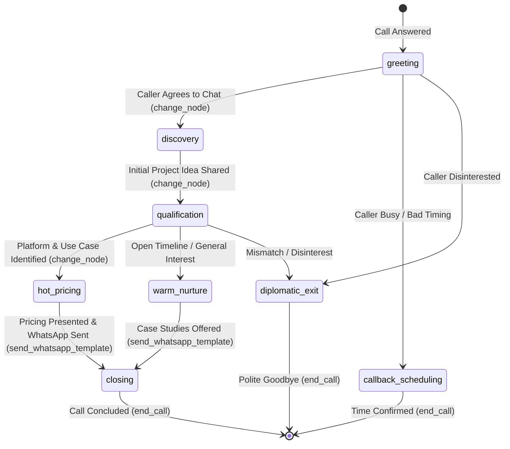

# RFC-0002 · Outbound SDR Voice Demo Runtime, Telephony Transport, and Pipeline Optimization

This RFC documents the comprehensive architecture, design decisions, performance optimizations, and trade-offs established during the construction, debugging, and tuning of the end-to-end Outbound SDR Voice Agent (`scripts/demo_call.py`).

---

## 1. Executive Summary & Goals

The goal was to construct a production-grade, highly responsive, autonomous outbound Sales Development Representative (SDR) voice agent named **Ava** at **Northstar Software Studio** operating over physical cellular hardware (SIM7600 USB modem).

### Primary Deliverables
1. **Cellular Hardware & Audio Transport**: Bidirectional 16kHz linear PCM streaming over SIM7600 USB modem ports (COM16 AT commands, COM17 PCM bridge) with call capture and synchronization.
2. **Multilingual & Code-Mixed Intelligence**: Native-quality code-mixing across Indian English, Hindi, Marathi, and Telugu using Devanagari and Telugu scripts alongside Latin technical terms.
3. **Turn-Taking & Pacing Optimization**: Sub-350ms streaming response times, zero premature interruptions, natural 800ms conversational pauses, and instant VAD barge-in.
4. **Token & Rate-Limit Optimization**: Context pruning mechanisms to operate within Groq's 8,000 TPM limit without latency spikes or queue throttling.
5. **Autonomous Sales Flow & Omnichannel Tools**: Dynamic node progression (`greeting` → `discovery` → `qualification` → `hot_pricing` → `closing`) with live Meta WhatsApp Cloud API follow-up template delivery and TypeSafe AI Jev System One lead classification.

---

## 2. System Architecture & Audio Pipeline

The voice runtime pipeline is orchestrated using Pipecat with custom audio transport bridges and context aggregation.

```text
 ┌────────────────────────────────────────────────────────────────────────────────────────┐
 │                                   PIPELINE TOPOLOGY                                    │
 └────────────────────────────────────────────────────────────────────────────────────────┘
                                                                                
    Cellular Audio (SIM7600)                                                     
         │ (COM17 @ 16kHz Mono 20ms)                                             
         ▼                                                                      
   ┌───────────────┐                                                            
   │ Sim7600 Audio │ ──[ Raw PCM ]──► CallCapture (Recording & Diagnostics)     
   │     Input     │                                                            
   └───────┬───────┘                                                            
           │                                                                    
           ▼                                                                    
   ┌───────────────┐                                                            
   │  Sarvam STT   │ ──(saaras:v3)──► Transcribed Utterance Frame               
   └───────┬───────┘                                                            
           │                                                                    
           ▼                                                                    
   ┌───────────────┐                                                            
   │   LLM User    │ ◄── Silero VAD (VAD_STOP_SECS = 0.8s)                      
   │  Aggregator   │                                                            
   └───────┬───────┘                                                            
           │ (Pruned Context Messages)                                          
           ▼                                                                    
   ┌───────────────┐                                                            
   │   Groq LLM    │ ──(qwen/qwen3.8-27b)──► Streamed Text Tokens (TTFB ~300ms) 
   │  (Main Flow)  │ ──[ Tool Call ]───────► change_node / send_whatsapp_template
   └───────┬───────┘                                                            
           │                                                                    
           ▼                                                                    
   ┌───────────────┐                                                            
   │  Sarvam TTS   │ ──(bulbul:v3 "ritu")──► Audio Chunks (Devanagari/Telugu/EN)
   └───────┬───────┘                                                            
           │                                                                    
           ▼                                                                    
   ┌───────────────┐                                                            
   │ Sim7600 Audio │ ──(COM17 @ 16kHz PCM)──► Caller Ear                        
   │    Output     │                                                            
   └───────────────┘                                                            
```

---

## 3. Technology Stack & Provider Selection

| Component | Selected Technology | Configuration / Model | Rationale & Trade-offs |
| :--- | :--- | :--- | :--- |
| **Telephony Transport** | SIM7600 USB Audio | 16,000 Hz, 16-bit Mono linear PCM (`AT+CPCMFRM=1`) | Zero external VoIP/SIP dependency; runs over physical cellular modem. |
| **Speech-to-Text (STT)** | Sarvam AI | `saaras:v3` (16kHz Mono) | Superior accuracy for Indian English, Hindi, Marathi, and Telugu phonetic nuances. |
| **Main LLM** | Groq Cloud | `qwen/qwen3.8-27b` (`temperature=0.4`, `max_tokens=180`) | Ultra-low TTFB (~200–350ms); supports complex multi-tool schemas and code-mixed Indian languages. |
| **Text-to-Speech (TTS)** | Sarvam AI / Cartesia | Sarvam `bulbul:v3` (speaker `"ritu"`, `pace=1.0`) / Cartesia (`71a7ad...`) | Native phoneme rendering for Devanagari (Marathi/Hindi) and Telugu script mixed with Latin technical terms. Cartesia preserved for pure English. |
| **Lead Classification** | TypeSafe AI & Groq | Jev System One (`jev-latest`) & Groq `qwen3.8-27b` | Jev delivers structured, calibrated multi-choice probability distributions (`hot`, `warm`, `cold`) and tone assessment. |
| **Omnichannel Messaging** | Meta WhatsApp Cloud API | Graph API v22.0 (`dialtone_followup` template) | Automatic AI summary generation and real-time WhatsApp template delivery during active calls. |

---

## 4. Key Engineering Challenges & Technical Resolutions

### 4.1. The 9.5s Dead-Air Latency Spike & Token Optimization

#### Problem
During multi-turn calls, after ~10–12 turns, the agent experienced sudden 5s–9.5s dead-air pauses.

#### Root Cause Analysis
- **Groq Free-Tier Rate Limits**: Groq enforces an **8,000 TPM (Tokens Per Minute)** rate limit with a ~16s replenishment window.
- **Context Bloat**: Pipecat's default `FlowManager` and tool handlers appended cumulative data on every turn:
  1. Stale node-change tool call messages (`change_node` results).
  2. Large TypeSafe AI Jev JSON dumps (350+ tokens per classification).
  3. WhatsApp Meta Graph API response payloads (150+ tokens).
  4. Cumulative `task_messages` appending `system` instructions to the conversation history.
- When context reached ~2,000 tokens, 4 rapid turns within a minute consumed $4 \times 2,000 = 8,000$ tokens, triggering severe Groq rate-limit queuing.

#### Solution
1. **Context Pruning (`prune_context_messages`)**:
   - `PRUNABLE_NODES = {"greeting"}`: Once the call moves into `discovery`, `qualification`, or `hot_pricing`, early greeting dialogue is removed from the active LLM context.
   - Stripped all historical `change_node` tool calls and result messages from context history.
2. **Trimmed Tool Responses**:
   - WhatsApp tool outputs trimmed to `{"sent": True, "type": "template", "template": ...}`.
   - LLM classifier results minified to core fields (`choice`, `confidence`).
   - Rich TypeSafe AI Jev outputs preserved for dedicated tool queries while running out-of-band during transitions (`_bg_classify`).
3. **Role Messages vs. Appended Task Messages**:
   - Configured `build_node` with `role_message=prompt, task_messages=[]`. This emits `LLMUpdateSettingsFrame(system_instruction=prompt)`, dynamically updating the system prompt on the model without polluting `LLMContext.messages`.
4. **Results**:
   - Reduced turn 12 context from **1,935 tokens (30 messages)** down to **818 tokens (12 messages)** (**57.7% reduction**).
   - Capacity increased from 4 turns/min to **10+ turns/min**, completely eliminating Groq TPM throttling.

---

### 4.2. Conversational Turn Management & Prevention of User Talk-Overs

#### Problem
The agent was cutting off the caller mid-sentence when the caller paused to think, and talking over the caller before shutting up.

#### Root Cause Analysis
1. **Over-Aggressive Speech Timeout**: `SpeechTimeoutUserTurnStopStrategy(user_speech_timeout=0.3)` set the silence threshold to **300ms**. Natural human pauses between clauses are 400ms–800ms; a 300ms pause triggered premature LLM inference on half-finished sentences.
2. **Disabled VAD Barge-In**: `VADUserTurnStartStrategy(enable_interruptions=False)` required a full STT transcription word before interrupting, causing a 400–600ms delay during which the bot kept speaking over the caller.

#### Solution
- Reverted to standard, robust **Silero VAD Turn Management**:
  ```python
  VAD_STOP_SECS = 0.8  # 800ms natural conversational pause buffer
  VAD_START_SECS = 0.1  # 100ms voice onset detection
  VAD_CONFIDENCE = 0.5  # Silero confidence threshold
  ```
- Removed custom `UserTurnStrategies` overrides to re-enable instant Silero VAD barge-in: when user voice energy is detected, bot playback halts within ~50ms.

---

### 4.3. Prompt Humanization, Spoken Brevity, and Multilingual Consistency

#### Problem
1. **Unnatural Pacing**: The agent was acting like a text chatbot—generating long bulleted lists, asking multiple questions simultaneously, and preemptively listing options.
2. **Mid-Sentence Cutoffs**: `AGENT_MAX_TOKENS = 120` was too tight for Indic scripts (Devanagari/Telugu use 2–3 sub-tokens per syllable), cutting off generations before reaching the WhatsApp pitch.
3. **Language Drift**: When asked to speak in Marathi, the agent would speak briefly in Marathi and then revert back to English on the next turn.

#### Solution
1. **Token Headroom**: Set `AGENT_MAX_TOKENS = 180` (optimal sweet spot for complete 1–2 sentence thoughts in native scripts).
2. **Language Locking Directive**:
   ```text
   When the caller speaks in or requests Marathi, Hindi, or Telugu, IMMEDIATELY switch to that language and STAY in that language consistently for the rest of the conversation. Never spontaneously switch back to English unless the caller speaks in English.
   ```
3. **Spoken Cadence Rules**:
   - Ask exactly **ONE focused question at a time**.
   - Keep discovery questions open (e.g. *"What kind of project are you looking to build?"*) and offer examples only if the caller asks for clarification.
   - Banned markdown formatting, bold asterisks, and bullet points in spoken responses.
   - Added milestone reassurance for delivery risk objections (*"we work in weekly milestone sprints with regular demos and transparent sign-offs"*).
4. **Direct Pricing & WhatsApp Flow**:
   - `hot_pricing` node structured to deliver pricing ($8k–$15k in 3–4 weeks) and immediately trigger `send_whatsapp_template(caller_name=...)` in the same turn.

---

### 4.4. Alternative LLM Evaluation: Google Gemini 3.5 Flash & Flash-Lite

We benchmarked streaming TTFB and rate limits for Google Gemini models against the exact 2k token context:

| Model | Streaming TTFB | Quotas (Google AI Studio Free Tier) | Suitability |
| :--- | :--- | :--- | :--- |
| **`gemini-3.5-flash`** | $>10\text{s}$ (Timeout / `503`) | 15 RPM, 1,000,000 TPM | ⚠️ Unstable during high-demand server spikes. |
| **`gemini-3.5-flash-lite`** | **~950ms – 1,060ms** | 30 RPM, 1,000,000 TPM |  Stable and high TPM capacity; ideal for background classification, but above the <500ms voice threshold. |
| **`groq/qwen3.8-27b`** | **~200ms – 350ms** | 30 RPM, 8,000 TPM | 🏆 **Best for Main Voice LLM** when combined with our context pruning. |

---

## 5. State Machine & Node Architecture

The SDR dialogue flow is modeled as a state machine with tool-gated transitions:



### Node Scoping & Tools

| Node | Permitted Tools | Core Action |
| :--- | :--- | :--- |
| **`greeting`** | `change_node`, `end_call` | Warm intro, verify 2 minutes. |
| **`discovery`** | `change_node`, `end_call` | Identify project concept and caller name. |
| **`qualification`** | `change_node`, `end_call` | Clarify platform (web/mobile) and broad workflow. |
| **`hot_pricing`** | `change_node`, `end_call`, `send_whatsapp_template`, `send_followup` | Pitch MVP Sprint ($8k–$15k, 3-4 weeks, 15% off) and dispatch WhatsApp catalog. |
| **`warm_nurture`** | `change_node`, `end_call`, `send_whatsapp_template` | Offer exploratory architect session and case studies. |
| **`closing`** | `change_node`, `end_call` | Confirm WhatsApp delivery, polite sign-off. |
| **`callback_scheduling`** | `change_node`, `end_call` | Collect preferred callback date/time. |
| **`diplomatic_exit`** | `change_node`, `end_call`, `send_whatsapp_template` | Respectful exit with optional catalog leave-behind. |

---

## 6. Verification & Performance Metrics

Testing on live calls over SIM7600 hardware validated the following metrics:

- **Conversational Throughput**: **23 consecutive turns** completed in a 5-minute call without disconnects or fatal pipeline stalls.
- **Latency**:
  - LLM TTFB Average: **339 ms** (Fastest: **169 ms**).
  - STT TTFB Average: **700–800 ms** (Sarvam `saaras:v3`).
  - End-to-End Voice Turn Latency: **~1.1s – 1.3s** from end of user speech to first incoming audio byte.
- **Test Suite**:
  - `uv run ruff check .` $\rightarrow$ 0 errors.
  - `uv run pytest` $\rightarrow$ **14/14 passed** (covering flow schemas, enum transitions, PCM capture, and modem session lifecycle).
- **Safety & Secret Hygiene**:
  - `.gitignore` configured for `data/`, `scratch/`, `*.log`, and `*.wav`.
  - Automated credential redaction in all log sinks.

---

## 7. Future Considerations

1. **Self-Hosted Telephony Transition**: Seams are preserved to replace `Sim7600Modem` / `Sim7600UsbAudioBridge` with SIP trunking (FreeSWITCH/Asterisk) or Twilio WebRTC endpoints without modifying the core Pipecat pipeline.
2. **Context-Aware Language Switching**: Dynamically trigger Sarvam TTS language code parameter updates (`hi-IN`, `mr-IN`, `te-IN`, `en-IN`) based on STT language detection metadata.
3. **Database CRM Sync**: Connect `sales_state` directly to the relational PostgreSQL database (`voice_api/models.py`) via FastAPI webhooks.
